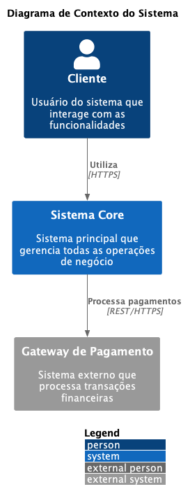
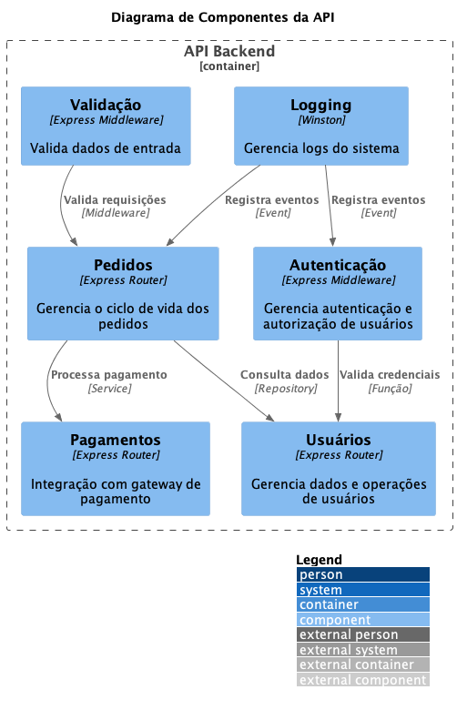

## ADR-039 - Diagramas C4 Model

### Contexto


```plantuml
@startuml
!include C4_Context.wsd

Person(customer, "Cliente", "Usuário do sistema")
System(system, "Sistema", "Core business system")
System_Ext(payment, "Gateway Pagamento", "Processador de pagamentos")

Rel(customer, system, "Usa")
Rel(system, payment, "Processa pagamentos")
@enduml
```

### Containers


```plantuml
@startuml
!include C4_Container.wsd

Container(web, "Web App", "React", "Interface do usuário")
Container(api, "API", "Node.js", "Backend API")
ContainerDb(db, "Database", "PostgreSQL", "Dados do sistema")

Rel(web, api, "API calls", "REST/JSON")
Rel(api, db, "Reads/Writes", "SQL")
@enduml
```

### Componentes


```plantuml
@startuml
!include C4_Component.wsd

Component(auth, "Auth", "Autenticação")
Component(orders, "Orders", "Gestão de pedidos")
Component(users, "Users", "Gestão de usuários")

Rel(auth, users, "Valida")
Rel(orders, users, "Consulta")
@enduml
```

### Código


```plantuml
@startuml
!include C4_Code.wsd

Class(Order)
Class(User)
Interface(PaymentGateway)

Order --> User
Order --> PaymentGateway
@enduml
```

### Sequência


