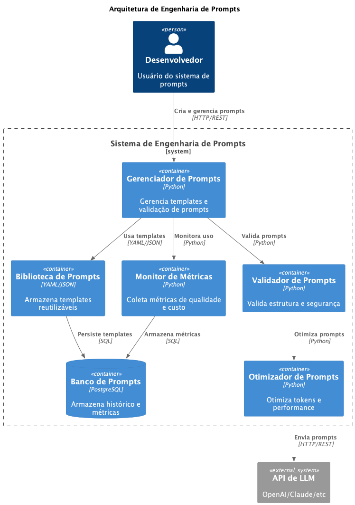

# 032 - 💬 Engenharia de Prompts para GenAI

Data: 2024-04-19

## ⚡ Status

Proposto

## 🎯 Contexto

O desenvolvimento de aplicações com IA Generativa requer uma abordagem estruturada para engenharia de prompts, considerando:
- Consistência e qualidade das respostas
- Reusabilidade e manutenibilidade
- Controle sobre o comportamento do modelo
- Otimização de custos e tokens
- Adaptabilidade a diferentes casos de uso
- Versionamento e evolução dos prompts
- Segurança e prevenção de ataques

## 🔨 Decisão

Implementar uma arquitetura de engenharia de prompts baseada em:

1. **Estrutura de Prompts**
   - Templates modulares
   - System messages padronizados
   - Injeção de contexto dinâmico
   - Parâmetros configuráveis
   - Validação de inputs/outputs

2. **Biblioteca de Componentes**
   - Prompts reutilizáveis
   - Funções de formatação
   - Validadores comuns
   - Transformadores de contexto
   - Handlers de erro

3. **Padrões de Design**
   - Chain of Responsibility
   - Few-shot Learning
   - Role-based Prompting
   - Task Decomposition
   - Recursive Refinement

4. **Controle de Qualidade**
   - Testes automatizados
   - Avaliação de outputs
   - Métricas de efetividade
   - Feedback loops
   - A/B testing

5. **Otimização**
   - Compressão de contexto
   - Token management
   - Caching estratégico
   - Batching de requisições
   - Priorização de conteúdo

6. **Segurança**
   - Sanitização de inputs
   - Prevenção de prompt injection
   - Rate limiting
   - Filtragem de conteúdo
   - Auditoria de uso

## 📊 Consequências

### Positivas

- Respostas mais consistentes
- Melhor manutenibilidade
- Reuso de código
- Custos otimizados
- Maior segurança
- Facilidade de evolução
- Debugging simplificado

### Negativas

- Complexidade inicial
- Overhead de desenvolvimento
- Necessidade de expertise
- Possível rigidez
- Curva de aprendizado

### Riscos

- Dependência excessiva de templates
  - Mitigação: Flexibilidade controlada
- Degradação de performance
  - Mitigação: Monitoramento e otimização
- Complexidade crescente
  - Mitigação: Refatoração periódica

## 🔄 Alternativas Consideradas

### Prompts Hardcoded
- Prós: Simplicidade inicial
- Contras: Difícil manutenção e evolução

### Framework Proprietário
- Prós: Suporte e features prontas
- Contras: Lock-in e custos

### Geração Dinâmica
- Prós: Máxima flexibilidade
- Contras: Difícil controle e previsibilidade

## 📚 Referências

- [OpenAI Prompt Engineering Guide](https://platform.openai.com/docs/guides/prompt-engineering)
- [LangChain Prompting Guide](https://python.langchain.com/docs/modules/model_io/prompts/)
- [Anthropic Prompt Design](https://docs.anthropic.com/claude/docs/prompt-design)
- [Microsoft Prompt Engineering](https://learn.microsoft.com/en-us/azure/cognitive-services/openai/concepts/prompt-engineering)

## 📝 Notas

- Começar com casos de uso simples
- Evoluir biblioteca gradualmente
- Documentar padrões e anti-padrões
- Manter exemplos atualizados
- Treinar equipe continuamente
- Revisar e adaptar periodicamente

## 🎨 Exemplos de Implementação

```python
class PromptTemplate:
    def __init__(self, template: str, validators: List[Callable] = None):
        self.template = template
        self.validators = validators or []

    def format(self, **kwargs) -> str:
        # Validação de inputs
        for validator in self.validators:
            validator(kwargs)
        
        # Formatação do prompt
        return self.template.format(**kwargs)

class PromptChain:
    def __init__(self, steps: List[PromptTemplate]):
        self.steps = steps

    async def execute(self, context: dict) -> str:
        result = context
        for step in self.steps:
            result = await self._execute_step(step, result)
        return result

# Exemplo de uso
customer_service = PromptTemplate(
    template="""
    Role: Você é um assistente de atendimento ao cliente profissional.
    Contexto: {context}
    Histórico do Cliente: {customer_history}
    
    Responda ao cliente de forma: 
    1. Empática
    2. Profissional
    3. Objetiva
    
    Pergunta do cliente: {question}
    """,
    validators=[
        validate_context,
        validate_customer_history,
        validate_question
    ]
)
```

## 🔍 Métricas de Avaliação

1. **Qualidade**
   - Taxa de respostas válidas
   - Consistência semântica
   - Aderência ao formato
   - Satisfação do usuário

2. **Performance**
   - Tempo de resposta
   - Uso de tokens
   - Taxa de cache hit
   - Custo por interação

3. **Segurança**
   - Taxa de detecção de injeção
   - Cobertura de sanitização
   - Incidentes de segurança
   - Violações de política

## 📊 Diagrama

 