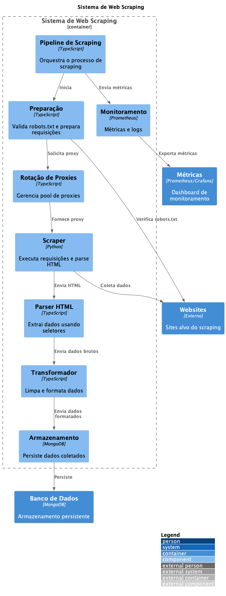

# ADR-047 - 🕷️ Sistema de Web Scraping

Data: 2024-04-19

## ⚡ Status

Proposto

## 🎯 Contexto



Para atender à necessidade de coletar dados estruturados de diversas fontes web, precisamos implementar um sistema de web scraping que considere:
- Respeito aos robots.txt
- Performance e escalabilidade
- Gestão de proxies
- Tratamento de anti-bot
- Extração estruturada
- Armazenamento eficiente
- Monitoramento
- Conformidade legal

## 🔨 Decisão

Adotar um sistema de web scraping com as seguintes características:

### Arquitetura

1. Pipeline de Scraping
   ```typescript
   interface ScrapingPipeline {
     stages: {
       preparation: RequestPreparation;
       execution: Scraper;
       extraction: DataExtractor;
       validation: Validator[];
       storage: DataStorage;
     };
   }
   ```

2. Componentes
   ```typescript
   interface RequestPreparation {
     validateRobotsTxt(url: string): Promise<boolean>;
     prepareHeaders(): Record<string, string>;
     rotateProxy(): string;
     setDelay(): number;
   }
   
   interface Scraper {
     fetch(url: string): Promise<Response>;
     parseHtml(html: string): CheerioStatic;
     handleErrors(error: Error): void;
   }
   ```

### Preparação

1. Gestão de Robots.txt
   ```python
   class RobotsManager:
       def __init__(self):
           self.parser = robotparser.RobotFileParser()
           
       def can_fetch(self, url: str, user_agent: str) -> bool:
           self.parser.set_url(f"{urlparse(url).scheme}://{urlparse(url).netloc}/robots.txt")
           self.parser.read()
           return self.parser.can_fetch(user_agent, url)
   ```

2. Rotação de Proxies
   ```typescript
   class ProxyRotator {
     private proxies: string[];
     private currentIndex: number = 0;
     
     rotate(): string {
       const proxy = this.proxies[this.currentIndex];
       this.currentIndex = (this.currentIndex + 1) % this.proxies.length;
       return proxy;
     }
     
     testProxy(proxy: string): Promise<boolean> {
       // Teste de latência e disponibilidade
       return Promise.resolve(true);
     }
   }
   ```

### Execução

1. Scraper Principal
   ```python
   class WebScraper:
       def __init__(self):
           self.session = requests.Session()
           self.headers = {
               'User-Agent': 'Mozilla/5.0 ...',
               'Accept': 'text/html,application/xhtml+xml...',
               'Accept-Language': 'pt-BR,pt;q=0.9,en-US;q=0.8,en;q=0.7'
           }
           
       async def fetch(self, url: str) -> str:
           response = await self.session.get(
               url,
               headers=self.headers,
               timeout=30
           )
           return response.text
   ```

2. Parser
   ```typescript
   class HtmlParser {
     parse(html: string): CheerioStatic {
       return cheerio.load(html);
     }
     
     extract($: CheerioStatic, selector: string): string[] {
       return $(selector)
         .map((_, el) => $(el).text().trim())
         .get();
     }
   }
   ```

### Extração

1. Seletores
   ```typescript
   interface Selectors {
     [key: string]: {
       selector: string;
       type: 'text' | 'attribute' | 'html';
       attribute?: string;
       transform?: (value: string) => any;
     };
   }
   ```

2. Transformação
   ```typescript
   class DataTransformer {
     clean(text: string): string {
       return text
         .replace(/\s+/g, ' ')
         .trim();
     }
     
     parse(value: string, type: string): any {
       switch(type) {
         case 'number':
           return parseFloat(value.replace(/[^\d.,]/g, ''));
         case 'date':
           return new Date(value);
         default:
           return value;
       }
     }
   }
   ```

### Armazenamento

1. Interface
   ```typescript
   interface DataStorage {
     save(data: any): Promise<void>;
     update(query: any, data: any): Promise<void>;
     find(query: any): Promise<any[]>;
     delete(query: any): Promise<void>;
   }
   ```

2. Implementação
   ```typescript
   class MongoStorage implements DataStorage {
     private collection: Collection;
     
     async save(data: any): Promise<void> {
       await this.collection.insertOne({
         ...data,
         createdAt: new Date(),
         source: data.url
       });
     }
   }
   ```

### Monitoramento

1. Métricas
   ```prometheus
   # Performance
   scraping_requests_total
   scraping_request_duration_seconds
   scraping_errors_total
   
   # Resources
   scraping_proxy_usage
   scraping_memory_usage_bytes
   scraping_cpu_usage_percent
   ```

2. Logs
   ```typescript
   interface ScrapingLog {
     timestamp: Date;
     url: string;
     success: boolean;
     duration: number;
     proxy?: string;
     error?: string;
     dataSize: number;
   }
   ```

## 📊 Consequências

### Positivas
- Coleta automatizada
- Dados estruturados
- Escalabilidade
- Monitoramento completo
- Resiliência
- Conformidade
- Flexibilidade

### Negativas
- Manutenção constante
- Custos de infraestrutura
- Complexidade técnica
- Bloqueios potenciais
- Dependência de estrutura HTML

### Riscos
- Bloqueio por sites
  - Mitigação: Rotação de IPs
- Dados inconsistentes
  - Mitigação: Validação
- Sobrecarga de sites
  - Mitigação: Rate limiting

## 🔄 Alternativas Consideradas

### Serviços de Scraping
- Prós: Infraestrutura pronta
- Contras: Custo alto

### Browser Automation
- Prós: Mais robusto
- Contras: Mais recursos

### APIs Oficiais
- Prós: Mais estável
- Contras: Limitado

## 📚 Referências

- [Scrapy](https://scrapy.org/)
- [Puppeteer](https://pptr.dev/)
- [Beautiful Soup](https://www.crummy.com/software/BeautifulSoup/)
- [Selenium](https://www.selenium.dev/)
- [Web Scraping Best Practices](https://www.scrapehero.com/web-scraping-best-practices/)

## 📝 Notas

- Implementar rate limiting
- Criar testes de resiliência
- Documentar seletores
- Definir políticas de retry
- Estabelecer monitoramento 