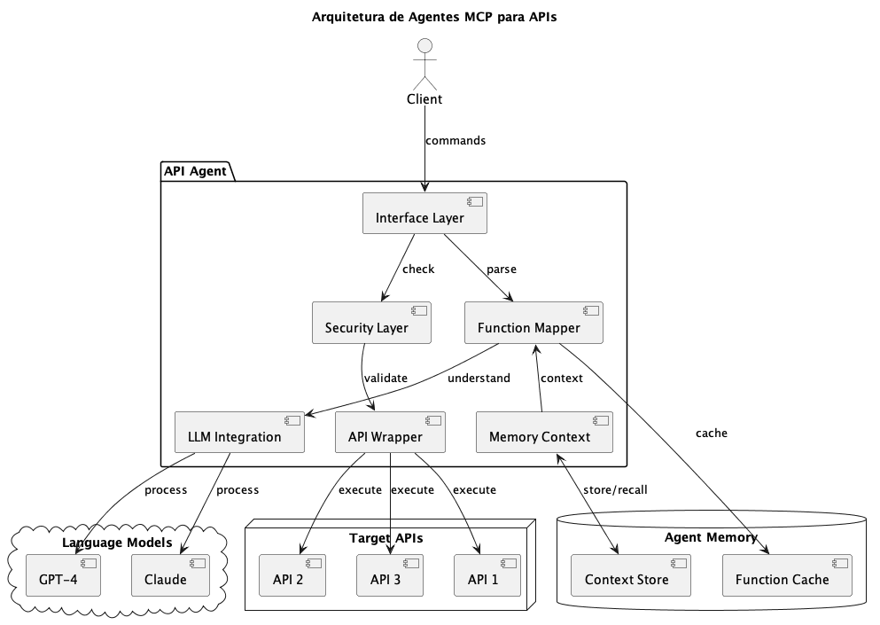

# ADR-040 - 🤖 MCPs para APIs como Agentes

Data: 2024-04-19

## ⚡ Status

Proposto

## 🎯 Contexto



Para melhorar a interoperabilidade e automação das APIs existentes, precisamos transformá-las em agentes inteligentes usando o protocolo MCP (Multi-Context Protocol), considerando:
- Integração com LLMs
- Automação de tarefas
- Contexto semântico
- Segurança e controle
- Monitoramento
- Escalabilidade

## 🔨 Decisão

Adotar uma estratégia de transformação de APIs em agentes MCP com as seguintes características:

### Arquitetura do Agente

1. Camada de Interface
   ```typescript
   interface ApiAgent {
     name: string;
     description: string;
     capabilities: string[];
     functions: AgentFunction[];
     authenticate(): Promise<void>;
     execute(command: string): Promise<Response>;
     learn(context: string): Promise<void>;
   }
   ```

2. Definição de Funções
   ```typescript
   interface AgentFunction {
     name: string;
     description: string;
     parameters: {
       type: string;
       required: boolean;
       schema: JSONSchema;
     }[];
     execute(params: any): Promise<any>;
   }
   ```

3. Integração com API
   ```typescript
   class ApiWrapper implements ApiAgent {
     constructor(
       private api: BaseAPI,
       private llm: LanguageModel
     ) {}
     
     async execute(command: string) {
       const intent = await this.llm.understand(command);
       const function = this.mapIntentToFunction(intent);
       return await function.execute(intent.parameters);
     }
   }
   ```

### Componentes do MCP

1. Prompt Engineering
   ```yaml
   system: |
     Você é um agente especializado na API X.
     Suas capacidades incluem:
     - Listar recursos
     - Criar registros
     - Atualizar dados
     - Executar operações

   user: "Liste todos os usuários ativos"
   
   assistant: |
     Vou executar a função listUsers com os
     seguintes parâmetros:
     {
       "status": "active",
       "fields": ["id", "name", "email"]
     }
   ```

2. Contexto e Memória
   ```typescript
   class AgentMemory {
     private context: Map<string, any>;
     
     remember(key: string, value: any) {
       this.context.set(key, value);
     }
     
     recall(key: string): any {
       return this.context.get(key);
     }
   }
   ```

3. Segurança
   ```typescript
   class SecurityLayer {
     validateCommand(command: string): boolean;
     sanitizeInput(input: any): any;
     checkPermissions(user: User, action: string): boolean;
     auditLog(action: string, result: any): void;
   }
   ```

### Pipeline de Transformação

1. Análise da API
   - Documentação OpenAPI
   - Endpoints e schemas
   - Autenticação e autorização
   - Rate limits

2. Geração de Agente
   - Mapeamento de funções
   - Definição de prompts
   - Configuração de contexto
   - Testes automatizados

3. Deployment
   - Containerização
   - Monitoramento
   - Escalabilidade
   - Logs e métricas

## 📊 Consequências

### Positivas
- Automação avançada
- Interface natural
- Reuso de código
- Integração simplificada
- Contextualização
- Aprendizado contínuo
- Documentação viva

### Negativas
- Complexidade adicional
- Custo de processamento
- Dependência de LLMs
- Manutenção mais complexa
- Necessidade de expertise

### Riscos
- Falhas de interpretação
  - Mitigação: Testes e validações
- Segurança comprometida
  - Mitigação: Camadas de proteção
- Performance degradada
  - Mitigação: Caching e otimização

## 🔄 Alternativas Consideradas

### APIs Tradicionais
- Prós: Mais simples e diretas
- Contras: Menos flexíveis

### Webhooks
- Prós: Eventos em tempo real
- Contras: Menos contexto

### RPC
- Prós: Performance melhor
- Contras: Menos semântica

## 📚 Referências

- [MCP Specification](https://github.com/mcp-spec)
- [LangChain Agents](https://langchain.readthedocs.io/)
- [OpenAI Function Calling](https://platform.openai.com/docs/guides/gpt/function-calling)
- [API Design Guidelines](https://google.aip.dev/)
- [Semantic APIs](https://www.semanticscholar.org/)

## 📝 Notas

- Criar pipeline de transformação
- Documentar padrões
- Implementar monitoramento
- Treinar equipe
- Estabelecer métricas 