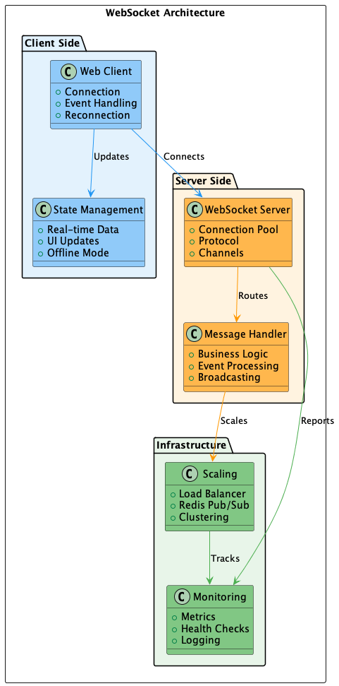

# 020 - 📝 🔌 WebSocket

Data: 2024-03-21

## ⚡ Status

Aceito

## 🎯 Contexto

Precisamos de comunicação em tempo real para:
- Atualizações instantâneas de UI
- Notificações em tempo real
- Dados de streaming
- Chat e mensagens
- Monitoramento ao vivo
- Jogos multiplayer
- Colaboração em tempo real
- IoT e telemetria

## 🔨 Decisão

Adotar WebSocket como protocolo principal para comunicação em tempo real:

Princípios:
- Conexões persistentes
- Comunicação bidirecional
- Baixa latência
- Mensagens estruturadas
- Escalabilidade horizontal
- Fallback para polling
- Segurança por design

Padrões específicos:
- Implementação:
  - Socket.IO para cliente web
  - Gorilla WebSocket para Go
  - FastAPI WebSocket para Python
  - Redis pub/sub para escala
  - JWT para autenticação
  - Protocol buffers para mensagens

- Práticas:
  - Heartbeat para conexões
  - Reconexão automática
  - Circuit breaker
  - Rate limiting
  - Compressão de mensagens
  - Logging estruturado
  - Monitoramento em tempo real

Tipos de Mensagens:
- System Events:
  - Conexão/Desconexão
  - Heartbeat
  - Erro
  - Reconexão

- Business Events:
  - Notificações
  - Updates de dados
  - Chat
  - Comandos
  - Status

## 📊 Diagrama

## 📊 Consequências

### Positivas

- Baixa latência
- Comunicação eficiente
- Menos overhead de HTTP
- Experiência em tempo real
- Economia de banda
- Interatividade melhorada
- Suporte a streaming
- Bidirecionalidade nativa

### Negativas

- Complexidade de gestão
- Necessidade de fallback
- Manutenção de conexões
- Overhead de memória
- Complexidade de escala

### Riscos

- Conexões zumbis
  - Mitigação: Heartbeat e timeouts
- Sobrecarga de servidor
  - Mitigação: Load balancing, limites
- Problemas de segurança
  - Mitigação: Auth, rate limiting, validação

## 🔄 Alternativas Consideradas

### Server-Sent Events (SSE)
- Prós: Mais simples, unidirecional
- Contras: Sem bidirecionalidade, limitações

### Long Polling
- Prós: Compatibilidade, simples
- Contras: Overhead, latência alta

### gRPC Streaming
- Prós: Performance, contratos
- Contras: Suporte limitado em browsers

## 📚 Referências

- [WebSocket Protocol](https://tools.ietf.org/html/rfc6455)
- [Socket.IO Documentation](https://socket.io/docs/v4)
- [Gorilla WebSocket](https://github.com/gorilla/websocket)
- [FastAPI WebSocket](https://fastapi.tiangolo.com/advanced/websockets/)

## 📝 Notas

- Criar guias de implementação
- Estabelecer padrões de mensagens
- Definir estratégia de escala
- Documentar práticas de segurança
- Implementar monitoramento
- Treinar equipe em WebSocket 