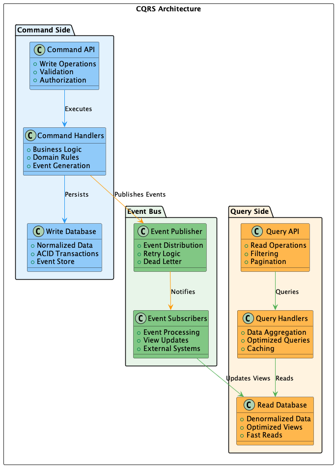

# 004 - 📝 🏛️ Implementação de CQRS

Data: 2024-03-21

## ⚡ Status

Aceito

## 🎯 Contexto

Com a migração para microsserviços, enfrentamos desafios específicos relacionados ao gerenciamento de dados:
- Complexidade em queries de leitura otimizadas
- Sobrecarga no banco de dados principal
- Dificuldade em escalar operações de leitura e escrita independentemente
- Performance comprometida em relatórios complexos
- Necessidade de diferentes modelos de dados para diferentes visões
- Consistência eventual em sistemas distribuídos

## 🔨 Decisão

Adotar o padrão Command Query Responsibility Segregation (CQRS) para separar operações de leitura e escrita.

Justificativas:
- Separação clara entre modelos de leitura e escrita
- Otimização independente de queries
- Melhor escalabilidade para leituras
- Suporte natural à consistência eventual
- Facilita implementação de Event Sourcing
- Performance otimizada para cada tipo de operação
- Melhor suporte a diferentes requisitos de persistência

## 📊 Diagrama

## 📊 Consequências

### Positivas

- Queries de leitura mais eficientes
- Melhor performance em relatórios
- Escalabilidade independente
- Modelo de dados otimizado por caso de uso
- Facilidade em adicionar novas visões
- Melhor auditoria de mudanças

### Negativas

- Aumento na complexidade do sistema
- Necessidade de sincronização entre modelos
- Possível latência na consistência
- Duplicação de dados
- Curva de aprendizado da equipe

### Riscos

- Consistência eventual pode afetar UX
  - Mitigação: Feedback claro ao usuário sobre estado dos dados
- Complexidade na manutenção de múltiplos modelos
  - Mitigação: Automação na sincronização e testes
- Overhead desnecessário em casos simples
  - Mitigação: Aplicar apenas onde necessário

## 🔄 Alternativas Consideradas

### CRUD Tradicional
- Prós: Mais simples e direto
- Contras: Limitações de performance e escalabilidade

### Event Sourcing sem CQRS
- Prós: Mantém histórico de eventos
- Contras: Complexidade sem benefícios de separação

### Cached Views
- Prós: Mais simples que CQRS completo
- Contras: Limitado em flexibilidade

## 📚 Referências

- [CQRS Pattern](https://martinfowler.com/bliki/CQRS.html)
- [CQRS Journey](https://docs.microsoft.com/en-us/previous-versions/msp-n-p/jj554200(v=pandp.10))
- [Event Sourcing and CQRS](https://www.eventstore.com/blog/event-sourcing-and-cqrs)
- [CQRS Design Pattern](https://medium.com/design-microservices-architecture-with-patterns/cqrs-design-pattern-in-microservices-architectures-5d41e359768c)

## 📝 Notas

- Implementação inicial em domínios com alta demanda de leitura
- Necessário definir estratégia de sincronização entre modelos
- Importante monitorar latência de consistência
- Documentar claramente padrões de implementação 