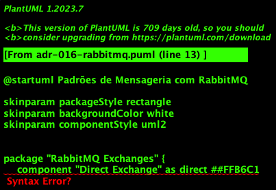

# 016 - 📝 📨 Padrões de Mensageria

Data: 2024-03-21

## ⚡ Status

Aceito

## 🎯 Contexto

Com a arquitetura distribuída, precisamos:
- Comunicação assíncrona entre serviços
- Garantia de entrega de mensagens
- Processamento resiliente
- Escalabilidade horizontal
- Desacoplamento de serviços
- Rastreabilidade de eventos
- Suporte a diferentes padrões de integração

## 🔨 Decisão

Adotar RabbitMQ como plataforma principal de mensageria com suporte a múltiplos padrões de comunicação:

Princípios:
- Message-Driven Architecture
- Publish-Subscribe
- Request-Reply quando necessário
- Routing inteligente
- Garantia de entrega
- Processamento idempotente
- Rastreabilidade completa

Padrões específicos:
- RabbitMQ como message broker principal
- Exchanges por domínio
- Filas com Dead Letter Exchange (DLX)
- Retry com backoff exponencial
- Circuit Breaker em consumers
- Monitoramento com métricas
- Message TTL quando aplicável

Tipos de Exchange:
- Direct: routing 1:1
- Topic: routing baseado em padrões
- Fanout: broadcast
- Headers: routing baseado em atributos

Padrões de Mensagem:
- Commands (direct exchange)
- Events (topic/fanout exchange)
- Queries (direct + reply-to)
- Notifications (fanout exchange)

## 📊 Diagrama

## 📊 Consequências

### Positivas

- Flexibilidade nos padrões de routing
- Garantia de entrega built-in
- Suporte a múltiplos protocolos
- Setup mais simples
- Menor curva de aprendizado
- Boa documentação
- Comunidade ativa
- Menor overhead operacional

### Negativas

- Limitações de escala vs Kafka
- Sem replay nativo de mensagens
- Storage limitado
- Complexidade em clusters grandes
- Necessidade de HA cuidadoso

### Riscos

- Perda de mensagens em falhas
  - Mitigação: HA cluster, persistent queues
- Problemas de performance
  - Mitigação: Sharding, lazy queues
- Filas muito grandes
  - Mitigação: TTL, message expiration

## 🔄 Alternativas Consideradas

### Apache Kafka
- Prós: Alta escala, replay de eventos
- Contras: Complexidade, curva de aprendizado

### AWS SQS/SNS
- Prós: Managed service, fácil setup
- Contras: Vendor lock-in, custo

### gRPC
- Prós: Performance, contratos fortes
- Contras: Síncrono, complexidade

## 📚 Referências

- [RabbitMQ](https://www.rabbitmq.com/)
- [RabbitMQ Patterns](https://www.rabbitmq.com/getstarted.html)
- [Enterprise Integration Patterns](https://www.enterpriseintegrationpatterns.com/)
- [Message Queue Design Patterns](https://docs.microsoft.com/en-us/azure/architecture/patterns/publisher-subscriber)

## 📝 Notas

- Criar guias de implementação
- Estabelecer padrões de exchanges/queues
- Definir estratégia de HA
- Documentar padrões de retry
- Implementar monitoramento
- Treinar equipe em RabbitMQ 