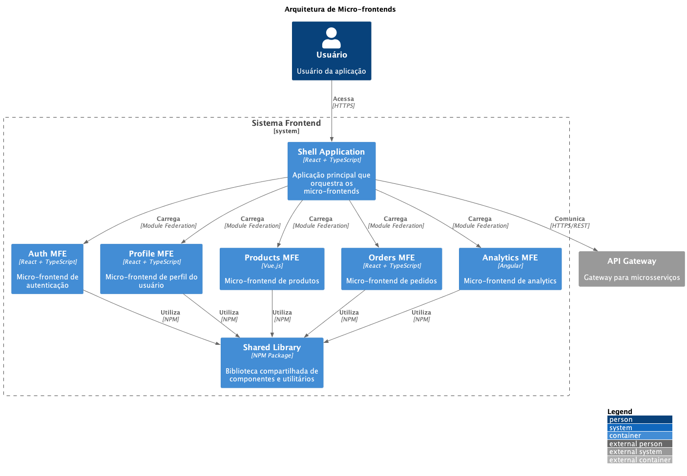

# 🎨 ADR-021: Arquitetura de Micro-frontends

## Status

Proposto

## Contexto

Com o crescimento da aplicação e a necessidade de escalar o desenvolvimento frontend de forma independente, similar ao que já fazemos com microsserviços no backend, precisamos adotar uma estratégia que permita:

- Desenvolvimento independente de diferentes partes do frontend
- Deploy independente de cada módulo
- Autonomia para times diferentes
- Tecnologias diferentes para diferentes módulos quando necessário
- Melhor gerenciamento de estado e performance

## Decisão

Decidimos adotar uma arquitetura de Micro-frontends utilizando Module Federation do Webpack 5 como principal tecnologia de implementação.

### Principais Aspectos da Implementação

1. **Shell Application**
   - Aplicação principal que gerencia o roteamento
   - Orquestra o carregamento dos micro-frontends
   - Gerencia estado global quando necessário

2. **Module Federation**
   - Permite compartilhamento de código em runtime
   - Carregamento dinâmico de módulos
   - Versionamento independente

3. **Shared Library**
   - Componentes UI compartilhados
   - Utilitários comuns
   - Design System

4. **Comunicação**
   - Event Bus para comunicação entre micro-frontends
   - Custom Events para interações específicas
   - Estado global compartilhado quando necessário

## Consequências

### Positivas

- Times podem trabalhar de forma independente
- Deploys independentes reduzem risco
- Melhor escalabilidade do desenvolvimento
- Possibilidade de usar diferentes tecnologias
- Melhor isolamento de código e responsabilidades

### Negativas

- Maior complexidade de desenvolvimento
- Necessidade de maior coordenação entre times
- Possível duplicação de dependências
- Complexidade adicional no build e deploy
- Necessidade de forte governança de arquitetura

## Riscos

- Inconsistência na experiência do usuário
- Problemas de performance com múltiplos bundles
- Complexidade na depuração
- Dificuldade em manter consistência no design system

### Mitigação

- Estabelecer guidelines claros de desenvolvimento
- Implementar monitoramento efetivo
- Criar processos de revisão de arquitetura
- Manter documentação atualizada
- Investir em ferramentas de teste e integração

## Alternativas Consideradas

1. **Single Page Application Monolítica**
   - Mais simples de desenvolver
   - Menor complexidade operacional
   - Limitações em escala

2. **iframes**
   - Isolamento completo
   - Problemas de UX
   - Limitações técnicas

3. **Web Components**
   - Maior compatibilidade
   - Menor suporte a frameworks modernos
   - Complexidade de implementação

## Referências

- [Micro Frontends](https://martinfowler.com/articles/micro-frontends.html)
- [Module Federation](https://webpack.js.org/concepts/module-federation/)
- [Micro-frontends Architecture](https://micro-frontends.org/)
- [Single-spa Framework](https://single-spa.js.org/)

## Notas

- A implementação será gradual, começando com módulos menos críticos
- Necessário estabelecer métricas de performance
- Criar processo de CI/CD específico para micro-frontends
- Estabelecer práticas de teste end-to-end 