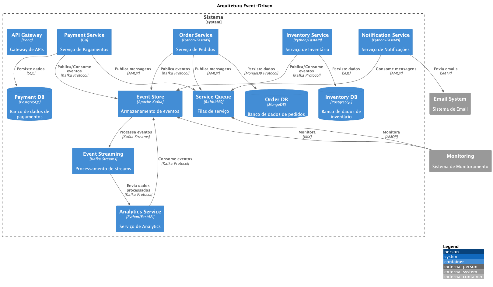

# 🔄 ADR-022: Arquitetura Event-Driven

## Status

Proposto

## Contexto

Com o crescimento do sistema e a necessidade de garantir consistência, escalabilidade e desacoplamento entre serviços, precisamos de uma arquitetura que permita:

- Comunicação assíncrona entre serviços
- Processamento distribuído de eventos
- Rastreabilidade de operações
- Alta disponibilidade e resiliência
- Consistência eventual entre serviços

## Decisão

Decidimos adotar uma arquitetura Event-Driven utilizando Apache Kafka como principal plataforma de eventos, complementada por RabbitMQ para mensageria específica de serviços.

### Principais Componentes

1. **Event Store (Apache Kafka)**
   - Armazenamento durável de eventos
   - Garantia de ordenação
   - Particionamento para escalabilidade
   - Replicação para alta disponibilidade

2. **Event Streaming (Kafka Streams)**
   - Processamento em tempo real
   - Agregações e transformações
   - Window operations
   - State stores

3. **Service Queue (RabbitMQ)**
   - Mensageria ponto a ponto
   - Filas específicas por serviço
   - Dead Letter Queues
   - Retry policies

4. **Event Schemas**
   - Schema Registry
   - Versionamento de eventos
   - Compatibilidade retroativa
   - Documentação automática

## Consequências

### Positivas

- Alto desacoplamento entre serviços
- Melhor escalabilidade
- Processamento assíncrono eficiente
- Facilidade para adicionar novos consumidores
- Melhor resiliência a falhas

### Negativas

- Maior complexidade operacional
- Necessidade de garantir ordem de eventos
- Desafios com consistência eventual
- Complexidade no debugging
- Necessidade de monitoramento robusto

## Riscos

- Duplicação de eventos
- Perda de mensagens
- Problemas de performance
- Complexidade no troubleshooting
- Custos operacionais elevados

### Mitigação

- Implementar idempotência em consumidores
- Monitoramento detalhado
- Testes de carga e resiliência
- Documentação de padrões de eventos
- Ferramentas de rastreamento

## Alternativas Consideradas

1. **REST Síncrono**
   - Mais simples de implementar
   - Acoplamento forte
   - Menor resiliência

2. **gRPC**
   - Melhor performance
   - Suporte a streaming
   - Maior acoplamento

3. **GraphQL Subscriptions**
   - Bom para real-time
   - Complexidade adicional
   - Menos adequado para processamento assíncrono

## Referências

- [Event-Driven Architecture](https://martinfowler.com/articles/201701-event-driven.html)
- [Apache Kafka Documentation](https://kafka.apache.org/documentation/)
- [Event Sourcing Pattern](https://docs.microsoft.com/en-us/azure/architecture/patterns/event-sourcing)
- [CQRS Pattern](https://martinfowler.com/bliki/CQRS.html)

## Notas

- Implementar gradualmente por domínio
- Estabelecer padrões de eventos
- Criar ferramentas de monitoramento
- Documentar padrões de retry e DLQ
- Treinar equipes em debugging distribuído 