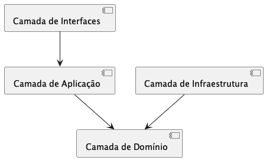

# 011 - 📝 🏛️ Adoção de DDD e Arquitetura Hexagonal

Data: 2024-03-21

## ⚡ Status

Aceito

## 🎯 Contexto

Com a migração para microsserviços, precisamos de um padrão arquitetural que:
- Facilite a modelagem de domínios complexos
- Mantenha a consistência entre serviços
- Permita evolução independente
- Proteja a lógica de negócio
- Facilite testes e manutenção
- Suporte diferentes tecnologias
- Mantenha baixo acoplamento

## 🔨 Decisão

Adotar Domain-Driven Design (DDD) com Arquitetura Hexagonal (Ports and Adapters) como padrões arquiteturais principais.

Justificativas:
- Alinhamento entre código e negócio
- Isolamento da lógica de domínio
- Fronteiras claras entre contextos
- Independência de tecnologia
- Facilidade de testes
- Flexibilidade para evolução
- Suporte natural a microsserviços
- Manutenibilidade melhorada

## 📊 Consequências

### Positivas

- Código mais próximo do domínio
- Melhor comunicação com stakeholders
- Isolamento de complexidade
- Testes mais focados
- Manutenção simplificada
- Evolução independente de componentes
- Reutilização de lógica de negócio
- Menor acoplamento tecnológico

### Negativas

- Curva de aprendizado significativa
- Overhead inicial de desenvolvimento
- Mais código boilerplate
- Complexidade adicional em casos simples
- Necessidade de mais planejamento

### Riscos

- Complexidade excessiva em domínios simples
  - Mitigação: Permitir abordagens mais simples quando apropriado
- Resistência da equipe à mudança
  - Mitigação: Treinamento e documentação clara
- Inconsistência na implementação
  - Mitigação: Criar guias e templates claros

## 🔄 Alternativas Consideradas

### Arquitetura em Camadas Tradicional
- Prós: Mais simples e familiar
- Contras: Maior acoplamento, menos flexível

### Clean Architecture
- Prós: Objetivos similares, bem documentada
- Contras: Mais rígida, menos foco no domínio

### Event-Driven Architecture
- Prós: Bom para sistemas distribuídos
- Contras: Complexidade em consistência, debugging difícil

## 📚 Referências

- [Domain-Driven Design](https://domainlanguage.com/ddd/)
- [Hexagonal Architecture](https://alistair.cockburn.us/hexagonal-architecture/)
- [Strategic DDD](https://www.domainlanguage.com/ddd/reference/)
- [DDD and Microservices](https://www.infoq.com/articles/ddd-microservices/)

## 📝 Notas

- Criar guias de modelagem de domínio
- Estabelecer padrões de implementação
- Definir processo de descoberta de domínio
- Documentar bounded contexts
- Manter catálogo de contextos

## 📊 Diagramas

O diagrama acima ilustra a estrutura básica da arquitetura hexagonal com DDD, mostrando as principais camadas e suas dependências:

- **Camada de Interfaces**: Adaptadores primários (UI, API, etc.)
- **Camada de Aplicação**: Coordena o fluxo entre interfaces e domínio
- **Camada de Domínio**: Core da aplicação com regras de negócio
- **Camada de Infraestrutura**: Adaptadores secundários (BD, mensageria, etc.)

As setas indicam o fluxo de dependência entre as camadas, sempre apontando para o domínio.

O código fonte do diagrama está disponível em: [adr-011-ddd-hexagonal.wsd](diagrams/adr-011-ddd-hexagonal.wsd) 