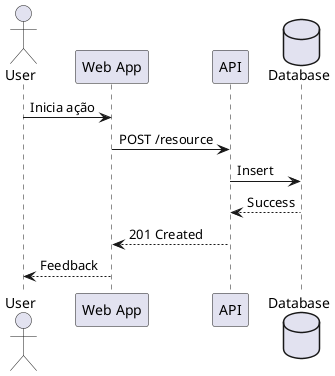

# ADR-039 - 📊 C4Model para Documentação de Arquitetura

Data: 2024-04-19

## ⚡ Status

Proposto

## 🎯 Contexto

Para melhorar a documentação e comunicação da arquitetura do sistema, precisamos adotar uma abordagem padronizada e hierárquica usando o C4Model, considerando:
- Múltiplos níveis de abstração
- Clareza na comunicação
- Manutenibilidade dos diagramas
- Integração com ferramentas
- Diferentes stakeholders

## 🔨 Decisão

Adotar o C4Model como padrão de documentação arquitetural com as seguintes características:

### Níveis do C4Model

1. Nível 1 - Contexto do Sistema
   ```plantuml
   @startuml
   !include C4_Context.puml
   
   Person(customer, "Cliente", "Usuário do sistema")
   System(system, "Sistema", "Core business system")
   System_Ext(payment, "Gateway Pagamento", "Processador de pagamentos")
   
   Rel(customer, system, "Usa")
   Rel(system, payment, "Processa pagamentos")
   @enduml
   ```

2. Nível 2 - Containers
   ```plantuml
   @startuml
   !include C4_Container.puml
   
   Container(web, "Web App", "React", "Interface do usuário")
   Container(api, "API", "Node.js", "Backend API")
   ContainerDb(db, "Database", "PostgreSQL", "Dados do sistema")
   
   Rel(web, api, "API calls", "REST/JSON")
   Rel(api, db, "Reads/Writes", "SQL")
   @enduml
   ```

3. Nível 3 - Componentes
   ```plantuml
   @startuml
   !include C4_Component.puml
   
   Component(auth, "Auth", "Autenticação")
   Component(orders, "Orders", "Gestão de pedidos")
   Component(users, "Users", "Gestão de usuários")
   
   Rel(auth, users, "Valida")
   Rel(orders, users, "Consulta")
   @enduml
   ```

4. Nível 4 - Código
   ```plantuml
   @startuml
   !include C4_Code.puml
   
   Class(Order)
   Class(User)
   Interface(PaymentGateway)
   
   Order --> User
   Order --> PaymentGateway
   @enduml
   ```

### Diagramas de Sequência



### Padrões e Práticas

1. Nomenclatura
   - Nomes claros e consistentes
   - Verbos para relações
   - Substantivos para elementos

2. Organização
   - Um diagrama por nível
   - Diagramas complementares
   - Versionamento com código

3. Ferramentas
   - PlantUML para diagramas
   - VSCode com extensões
   - Automatização de geração

## 📊 Consequências

### Positivas
- Documentação clara e hierárquica
- Comunicação efetiva
- Manutenção simplificada
- Onboarding facilitado
- Visão completa do sistema
- Rastreabilidade
- Integração com código

### Negativas
- Overhead de manutenção
- Necessidade de ferramentas
- Curva de aprendizado
- Tempo de documentação
- Sincronização manual

### Riscos
- Documentação desatualizada
  - Mitigação: Automação e reviews
- Diagramas complexos
  - Mitigação: Foco na simplicidade
- Ferramentas inadequadas
  - Mitigação: Avaliação contínua

## 🔄 Alternativas Consideradas

### UML Tradicional
- Prós: Mais conhecido
- Contras: Menos hierárquico

### Mermaid
- Prós: Mais simples
- Contras: Menos recursos

### Draw.io
- Prós: Visual e intuitivo
- Contras: Difícil versionamento

## 📚 Referências

- [C4Model Official](https://c4model.com/)
- [PlantUML](https://plantuml.com/)
- [Structurizr](https://structurizr.com/)
- [Architecture Documentation](https://www.infoq.com/articles/C4-architecture-model/)
- [Diagramming Tools](https://www.thoughtworks.com/radar/tools)

## 📝 Notas

- Criar templates de diagramas
- Automatizar geração
- Integrar com CI/CD
- Treinar equipe
- Estabelecer processo de review 