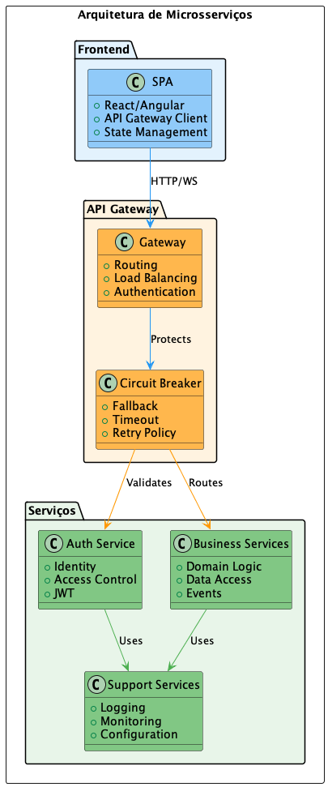

# 003 - 📝 🏛️ Arquitetura de Microsserviços

Data: 2024-03-21

## ⚡ Status

Aceito

## 🎯 Contexto

Nossa aplicação monolítica atual apresenta desafios de escalabilidade, manutenção e velocidade de desenvolvimento:
- Dificuldade em escalar componentes específicos
- Acoplamento forte entre módulos
- Ciclos de deploy longos e arriscados
- Dificuldade em adotar novas tecnologias
- Times dependentes uns dos outros para entregas
- Complexidade crescente no código base único

## 🔨 Decisão

Migrar gradualmente nossa arquitetura monolítica para microsserviços, decompondo a aplicação em serviços independentes e especializados.

Justificativas:
- Escalabilidade independente por serviço
- Isolamento de falhas
- Autonomia dos times
- Flexibilidade tecnológica
- Deploys mais rápidos e seguros
- Melhor organização do código por domínio
- Melhor definição de fronteiras de contexto

## 📊 Diagrama

```plantuml
@startuml
!include https://raw.githubusercontent.com/plantuml-stdlib/C4-PlantUML/master/C4_Container.puml

LAYOUT_WITH_LEGEND()

title Arquitetura de Microsserviços

Person(client, "Cliente", "Usuário do sistema")

System_Boundary(c1, "Sistema") {
    Container(api_gateway, "API Gateway", "Kong", "Roteamento, autenticação, rate limiting")
    
    Container(auth_service, "Auth Service", "Python/FastAPI", "Autenticação e autorização")
    ContainerDb(auth_db, "Auth DB", "PostgreSQL", "Dados de usuários e tokens")
    
    Container(user_service, "User Service", "Go", "Gestão de usuários e perfis")
    ContainerDb(user_db, "User DB", "MongoDB", "Dados de usuários")
    
    Container(notification_service, "Notification Service", "Python/FastAPI", "Envio de notificações")
    ContainerQueue(notification_queue, "Notification Queue", "RabbitMQ", "Fila de notificações")
    
    Container(product_service, "Product Service", "Go", "Catálogo de produtos")
    ContainerDb(product_db, "Product DB", "PostgreSQL", "Dados de produtos")
    
    Container(order_service, "Order Service", "Python/FastAPI", "Processamento de pedidos")
    ContainerDb(order_db, "Order DB", "MongoDB", "Dados de pedidos")
}

Rel(client, api_gateway, "Usa", "HTTPS")
Rel(api_gateway, auth_service, "Roteia", "HTTPS")
Rel(api_gateway, user_service, "Roteia", "HTTPS")
Rel(api_gateway, product_service, "Roteia", "HTTPS")
Rel(api_gateway, order_service, "Roteia", "HTTPS")

Rel(auth_service, auth_db, "Usa", "SQL")
Rel(user_service, user_db, "Usa", "MongoDB Protocol")
Rel(product_service, product_db, "Usa", "SQL")
Rel(order_service, order_db, "Usa", "MongoDB Protocol")

Rel(order_service, notification_queue, "Publica", "AMQP")
Rel(notification_service, notification_queue, "Consome", "AMQP")

@enduml
```



## 📊 Consequências

### Positivas

- Times mais autônomos e produtivos
- Deploys mais frequentes e seguros
- Melhor isolamento de falhas
- Escalabilidade granular
- Facilidade para experimentar novas tecnologias
- Código mais organizado por domínio
- Melhor definição de fronteiras de contexto

### Negativas

- Aumento na complexidade operacional
- Necessidade de orquestração distribuída
- Custos de infraestrutura mais altos
- Latência adicional na comunicação entre serviços
- Necessidade de monitoramento mais robusto

### Riscos

- Complexidade na consistência de dados distribuídos
  - Mitigação: Implementação de Saga Pattern e Event Sourcing
- Dificuldade em manter rastreabilidade
  - Mitigação: Implementação de distributed tracing
- Aumento nos custos operacionais
  - Mitigação: Dimensionamento adequado e autoscaling

## 🔄 Alternativas Consideradas

### Modularização do Monolito
- Prós: Menor complexidade operacional
- Contras: Mantém acoplamento, limita escalabilidade

### Arquitetura Serverless
- Prós: Menor gestão de infraestrutura
- Contras: Vendor lock-in, custos imprevisíveis

### SOA Tradicional
- Prós: Mais simples que microsserviços
- Contras: Menor isolamento, acoplamento via ESB

## 📚 Referências

- [Microservices Pattern](https://microservices.io/patterns/index.html)
- [Domain-Driven Design](https://martinfowler.com/tags/domain%20driven%20design.html)
- [The Twelve-Factor App](https://12factor.net/)
- [Building Microservices](https://samnewman.io/books/building_microservices/)

## 📝 Notas

- Migração será feita por domínios, começando pelos menos acoplados
- Necessário estabelecer práticas de DevOps e SRE
- Importante definir padrões de comunicação entre serviços
- Monitoramento e observabilidade são críticos 