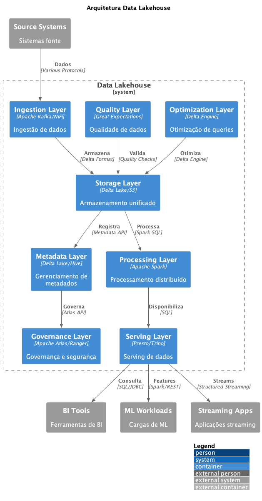

# 🏠 ADR-024: Arquitetura Data Lakehouse

## Status

Proposto

## Contexto

Com a necessidade de combinar as melhores características de Data Lakes e Data Warehouses, mantendo flexibilidade, performance e governança, precisamos de uma arquitetura que permita:

- Suporte a dados estruturados e não estruturados
- Performance de Data Warehouse com flexibilidade de Data Lake
- Garantia de ACID em grandes volumes de dados
- Suporte a múltiplos workloads (BI, ML, Analytics)
- Otimização de custos e recursos

## Decisão

Decidimos adotar uma arquitetura Data Lakehouse utilizando Delta Lake como formato de armazenamento principal, com Apache Spark para processamento e integração com ferramentas modernas de analytics e ML.

### Componentes Principais

1. **Storage Layer**
   - Delta Lake como formato principal
   - Suporte a ACID transactions
   - Time travel e versionamento
   - Schema evolution

2. **Processing Layer**
   - Apache Spark para processamento
   - Suporte a batch e streaming
   - Otimização de queries
   - Resource management

3. **Metadata Layer**
   - Catálogo unificado
   - Schema management
   - Data discovery
   - Lineage tracking

4. **Governance Layer**
   - Controle de acesso
   - Auditoria
   - Compliance
   - Data privacy

## Consequências

### Positivas

- Unificação de data lake e warehouse
- Transações ACID em grande escala
- Melhor performance em queries
- Suporte a múltiplos workloads
- Redução de custos operacionais

### Negativas

- Complexidade de implementação
- Necessidade de expertise específica
- Curva de aprendizado
- Possível vendor lock-in
- Custos iniciais elevados

## Riscos

- Resistência à mudança
- Complexidade operacional
- Dependência de tecnologias específicas
- Performance em casos extremos
- Custos não previstos

### Mitigação

- Treinamento extensivo
- POCs bem definidas
- Arquitetura modular
- Monitoramento robusto
- Planejamento de custos

## Alternativas Consideradas

1. **Arquitetura Lambda**
   - Complexidade maior
   - Duplicação de código
   - Custos mais altos

2. **Data Warehouse + Data Lake**
   - Ambientes separados
   - Sincronização complexa
   - Custos duplicados

3. **Cloud Data Warehouse**
   - Menor flexibilidade
   - Custos mais altos
   - Vendor lock-in

## Referências

- [Lakehouse Architecture](https://databricks.com/blog/2020/01/30/what-is-a-data-lakehouse.html)
- [Delta Lake Documentation](https://docs.delta.io/latest/delta-intro.html)
- [Modern Analytics Architecture](https://www.databricks.com/blog/2019/08/14/productionizing-machine-learning-with-delta-lake.html)
- [Data Mesh Principles](https://martinfowler.com/articles/data-mesh-principles.html)

## Notas

- Implementar gradualmente por domínio
- Estabelecer práticas de DataOps
- Definir métricas de sucesso
- Criar centro de excelência
- Documentar best practices 