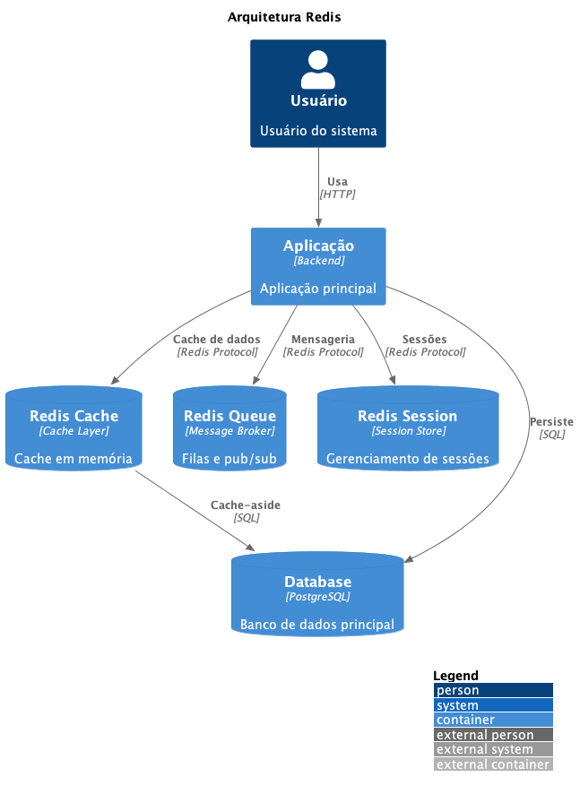

# ADR-056 - Adoção do Redis

## Status

Proposto

## Contexto

Nossa aplicação necessita de uma solução robusta para cache em memória, gerenciamento de sessões e mensageria. Precisamos de uma ferramenta que seja rápida, confiável e versátil para atender múltiplos casos de uso.

## Decisão

Decidimos adotar o Redis como nossa solução principal para cache em memória, gerenciamento de sessões e message broker, aproveitando sua versatilidade e performance.

### Casos de Uso

1. **Cache de Dados**
   - Cache-aside pattern
   - Cache de resultados de queries
   - Cache de objetos serializados
   - Invalidação seletiva

2. **Gerenciamento de Sessões**
   - Sessões de usuário
   - Tokens JWT
   - Rate limiting
   - Blacklisting

3. **Message Broker**
   - Filas de mensagens
   - Pub/Sub
   - Stream processing
   - Job queues

4. **Estruturas de Dados**
   - Strings
   - Lists
   - Sets
   - Sorted Sets
   - Hashes

## Consequências

### Positivas

1. **Performance**
   - Operações em memória
   - Latência muito baixa
   - Alta throughput
   - Persistência configurável

2. **Versatilidade**
   - Múltiplos casos de uso
   - Estruturas de dados ricas
   - Comandos atômicos
   - Transações

3. **Escalabilidade**
   - Clustering
   - Replicação
   - Particionamento
   - Alta disponibilidade

4. **Ecossistema**
   - Ampla adoção
   - Boa documentação
   - Clientes maduros
   - Ferramentas de monitoramento

### Negativas

1. **Gestão de Memória**
   - Necessidade de monitoramento
   - Políticas de evicção
   - Custos de infraestrutura
   - Dimensionamento cuidadoso

2. **Complexidade**
   - Configuração de cluster
   - Estratégias de failover
   - Consistência eventual
   - Troubleshooting

3. **Operacional**
   - Backup e restore
   - Manutenção de índices
   - Migração de dados
   - Upgrades

## Alternativas Consideradas

1. **Memcached**
   - Mais simples
   - Menos recursos
   - Sem persistência
   - Sem estruturas complexas

2. **Hazelcast**
   - Mais complexo
   - Java-centric
   - Maior overhead
   - Curva de aprendizado maior

3. **Aerospike**
   - Mais caro
   - Menos comunidade
   - Foco em casos específicos
   - Complexidade operacional

## Referências

- [Documentação Oficial do Redis](https://redis.io/documentation)
- [Redis Best Practices](https://redis.io/topics/optimization)
- [Redis Enterprise](https://redis.com/redis-enterprise/) 