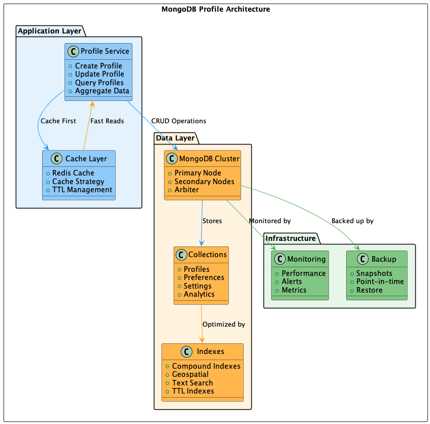

# 006 - 📝 💾 MongoDB para Perfis

Data: 2024-03-21

## ⚡ Status

Aceito

## 🎯 Contexto

O gerenciamento de perfis de usuário apresenta desafios específicos:
- Esquema de dados flexível e em evolução
- Alta frequência de leituras
- Necessidade de consultas complexas
- Dados não estruturados e aninhados
- Requisitos de escalabilidade horizontal
- Performance em operações de busca e filtro

## 🔨 Decisão

Adotar MongoDB como banco de dados principal para o serviço de perfis.

Justificativas:
- Esquema flexível e dinâmico
- Suporte nativo a documentos JSON
- Excelente performance em leituras
- Escalabilidade horizontal simplificada
- Queries ricas e expressivas
- Suporte a dados geoespaciais
- Replicação e sharding nativos
- Ecossistema maduro de ferramentas

## 📊 Diagrama

## 📊 Consequências

### Positivas

- Flexibilidade no esquema de dados
- Melhor performance em leituras
- Facilidade em evolução do modelo
- Queries mais expressivas
- Escalabilidade simplificada
- Menor complexidade no código
- Melhor suporte a dados não estruturados

### Negativas

- Sem transações ACID tradicionais
- Maior uso de memória
- Necessidade de expertise específica
- Possível duplicação de dados
- Custo de licenciamento Enterprise

### Riscos

- Inconsistência em dados relacionados
  - Mitigação: Implementação de transações distribuídas
- Crescimento descontrolado de índices
  - Mitigação: Monitoramento e otimização regular
- Performance em queries complexas
  - Mitigação: Design cuidadoso de índices

## 🔄 Alternativas Consideradas

### PostgreSQL JSON
- Prós: ACID, familiar para equipe
- Contras: Menor flexibilidade, performance inferior em alguns casos

### DynamoDB
- Prós: Serverless, alta disponibilidade
- Contras: Vendor lock-in, modelo de dados limitado

### Cassandra
- Prós: Alta escalabilidade, multi-master
- Contras: Queries limitadas, complexidade operacional

## 📚 Referências

- [MongoDB Architecture Guide](https://www.mongodb.com/mongodb-architecture)
- [Schema Design Patterns](https://www.mongodb.com/blog/post/building-with-patterns-a-summary)
- [MongoDB Performance Best Practices](https://docs.mongodb.com/manual/core/performance-best-practices/)
- [MongoDB vs PostgreSQL](https://www.mongodb.com/compare/mongodb-postgresql)

## 📝 Notas

- Necessário definir estratégia de backup e restore
- Importante monitorar crescimento de dados e índices
- Documentar padrões de modelagem de dados
- Implementar cache para queries frequentes 