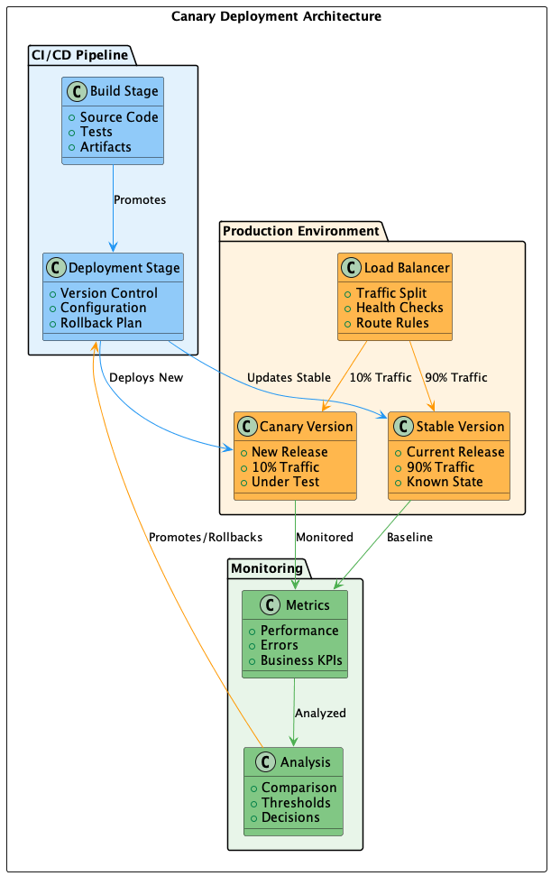

# 008 - 📝 🚀 Implantação Canary

Data: 2024-03-21

## ⚡ Status

Aceito

## 🎯 Contexto

Nossa estratégia atual de deploy apresenta riscos e limitações:
- Dificuldade em detectar problemas precocemente
- Impacto amplo em caso de falhas
- Rollbacks complexos e demorados
- Falta de validação em ambiente real
- Dificuldade em testar features específicas
- Métricas limitadas sobre impacto de mudanças

## 🔨 Decisão

Implementar Continuous Deployment com estratégia de Canary Releases.

Justificativas:
- Detecção precoce de problemas
- Redução de risco em deploys
- Validação gradual de mudanças
- Rollback rápido e automatizado
- Teste em tráfego real
- Métricas precisas de impacto
- Capacidade de teste A/B
- Deploy contínuo mais seguro

## 📊 Diagrama

## 📊 Consequências

### Positivas

- Deploys mais seguros e controlados
- Detecção rápida de problemas
- Impacto limitado de falhas
- Melhor qualidade em produção
- Feedback mais rápido
- Confiança no processo de deploy
- Métricas ricas sobre mudanças

### Negativas

- Complexidade na infraestrutura
- Necessidade de mais recursos
- Overhead em monitoramento
- Complexidade em feature flags
- Custo adicional de infraestrutura

### Riscos

- Complexidade na análise de métricas
  - Mitigação: Dashboards automatizados e alertas
- Inconsistência entre versões
  - Mitigação: Estratégia clara de rollout
- Falhas na detecção de problemas
  - Mitigação: Monitoramento abrangente

## 🔄 Alternativas Consideradas

### Blue-Green Deployment
- Prós: Mais simples de implementar
- Contras: Menos granular, maior risco

### Feature Flags sem Canary
- Prós: Menor complexidade infraestrutura
- Contras: Sem validação gradual

### Deploy Tradicional
- Prós: Processo conhecido
- Contras: Maior risco, menor controle

## 📚 Referências

- [Canary Deployments](https://martinfowler.com/bliki/CanaryRelease.html)
- [Progressive Delivery](https://www.split.io/blog/progressive-delivery-overview/)
- [Feature Flags Best Practices](https://launchdarkly.com/blog/best-practices-feature-flags/)
- [Kubernetes Canary Deployments](https://kubernetes.io/docs/concepts/cluster-administration/manage-deployment/#canary-deployments)

## 📝 Notas

- Necessário implementar monitoramento robusto
- Definir métricas claras para análise
- Automatizar processo de rollback
- Documentar procedimentos de emergência 