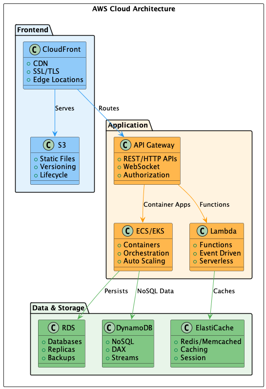

# 010 - 📝 ☁️ AWS Cloud

Data: 2024-03-21

## ⚡ Status

Aceito

## 🎯 Contexto

Nossa infraestrutura precisa suportar:
- Arquitetura de microsserviços
- Escalabilidade global
- Alta disponibilidade
- Segurança enterprise
- DevOps e automação
- Custos otimizados
- Compliance e regulamentações
- Inovação tecnológica constante

## 🔨 Decisão

Adotar AWS (Amazon Web Services) como nossa plataforma principal de cloud.

Justificativas:
- Líder de mercado com maior maturidade
- Serviços completos para microsserviços
- Presença global com múltiplas regiões
- Forte suporte a Kubernetes (EKS)
- Serviços gerenciados maduros
- Ferramentas robustas de segurança
- Ecossistema rico de integrações
- Preços competitivos com opções de otimização
- Suporte enterprise confiável

## 📊 Diagrama

## 📊 Consequências

### Positivas

- Infraestrutura escalável e resiliente
- Serviços gerenciados reduzindo overhead
- Ferramentas maduras de DevOps
- Segurança em camadas
- Compliance facilitada
- Automação extensiva
- Monitoramento integrado
- Disaster recovery simplificado

### Negativas

- Custos podem escalar rapidamente
- Complexidade na gestão de recursos
- Necessidade de expertise específica
- Potencial vendor lock-in
- Curva de aprendizado significativa

### Riscos

- Custos inesperados
  - Mitigação: Budgets, alertas e otimização contínua
- Dependência excessiva de serviços proprietários
  - Mitigação: Usar abstrações e padrões abertos
- Complexidade operacional
  - Mitigação: Investir em treinamento e documentação

## 🔄 Alternativas Consideradas

### Google Cloud Platform
- Prós: Forte em Kubernetes e ML
- Contras: Menor maturidade, menos serviços

### Microsoft Azure
- Prós: Integração com ferramentas MS, híbrido
- Contras: Complexidade, custo maior

### Multi-cloud
- Prós: Evita vendor lock-in
- Contras: Complexidade extrema, custos maiores

## 📚 Referências

- [AWS Architecture Center](https://aws.amazon.com/architecture/)
- [AWS Well-Architected Framework](https://aws.amazon.com/architecture/well-architected/)
- [Cloud Adoption Framework](https://aws.amazon.com/cloud-adoption-framework/)
- [AWS vs Other Clouds](https://aws.amazon.com/compare/)

## 📝 Notas

- Estabelecer centro de excelência cloud
- Implementar governança forte
- Definir padrões de IaC
- Criar estratégia de custos
- Planejar disaster recovery 