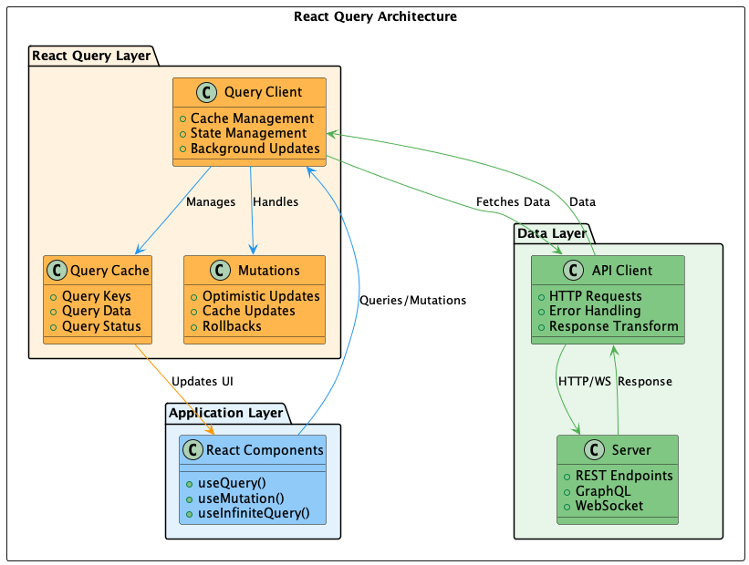

# 002 - 📝 🔄 React Query

Data: 2024-03-21

## ⚡ Status

Aceito

## 🎯 Contexto

Nossa aplicação React tem crescido em complexidade, especialmente no que diz respeito ao gerenciamento de estado e dados do servidor. Enfrentamos diversos desafios:

- Duplicação de lógica de fetching de dados entre componentes
- Cache inconsistente de dados do servidor
- Dificuldade em manter estados de loading e error
- Atualizações manuais do estado após mutações
- Performance comprometida devido a requisições desnecessárias
- Complexidade crescente no gerenciamento de estado global

## 🔨 Decisão

Decidimos adotar o React Query (TanStack Query) como nossa solução principal para gerenciamento de estado relacionado a dados do servidor.

Justificativas:
- Gerenciamento automático de cache
- Invalidação e revalidação inteligente de dados
- Suporte nativo a estados de loading, error e success
- Otimização de performance com background updates
- Deduplicação automática de requisições
- Suporte a TypeScript de primeira classe
- Integração simples com qualquer método de fetch
- Gerenciamento automático de dados obsoletos
- Suporte a infinite scroll e pagination

## 📊 Diagrama

## 📊 Consequências

### Positivas

- Redução significativa de código boilerplate
- Cache consistente entre componentes
- Melhor experiência do usuário com dados sempre atualizados
- Redução de bugs relacionados a estado
- Melhor performance com fetching otimizado
- Facilidade em implementar features como pull-to-refresh
- Melhor separação entre estado do servidor e estado da UI

### Negativas

- Curva de aprendizado inicial para o time
- Necessidade de refatorar código existente
- Possível overhead para casos muito simples
- Mudança no paradigma de gerenciamento de estado

### Riscos

- Complexidade adicional em casos de uso específicos
  - Mitigação: Documentação clara de patterns e casos de uso
- Possível resistência do time à mudança de paradigma
  - Mitigação: Workshops e pair programming
- Overhead de performance em aplicações pequenas
  - Mitigação: Configuração adequada de staleTime e cacheTime

## 🔄 Alternativas Consideradas

### Redux + RTK Query
- Prós: Familiar para o time, parte do ecossistema Redux
- Contras: Mais verboso, configuração mais complexa

### SWR
- Prós: Mais simples que React Query
- Contras: Menos recursos, ecossistema menor

### Apollo Client
- Prós: Excelente para GraphQL
- Contras: Muito específico para GraphQL, overhead para REST

### Context + Fetch
- Prós: Solução mais simples, sem dependências
- Contras: Sem gerenciamento de cache, mais código manual

## 📚 Referências

- [React Query Documentation](https://tanstack.com/query/latest)
- [React Query vs SWR](https://tanstack.com/query/latest/docs/react/comparison)
- [Practical React Query](https://tkdodo.eu/blog/practical-react-query)
- [React Query Patterns](https://tkdodo.eu/blog/react-query-patterns)

## 📝 Notas

- Implementação será gradual, começando por novas features
- Será criado um conjunto de hooks padronizados para operações comuns
- Necessário definir padrões para nomenclatura de queries e mutations
- Importante configurar DevTools em ambiente de desenvolvimento 