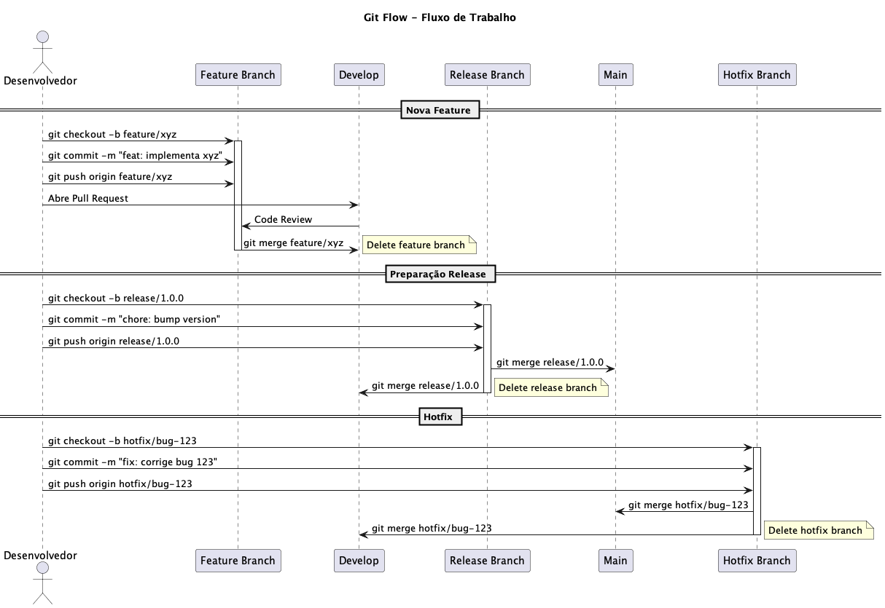

# 009 - 📝 🔀 Git Flow

Data: 2024-03-21

## ⚡ Status

Aceito

## 🎯 Contexto

Com a adoção de microsserviços e CD/Canary, precisamos de uma estratégia de branching que suporte:
- Múltiplos times trabalhando em paralelo
- Releases frequentes e controladas
- Hotfixes emergenciais
- Feature flags e trunk-based development
- Integração com CI/CD
- Rastreabilidade de mudanças
- Code review eficiente

## 🔨 Decisão

Adotar uma versão adaptada do Git Flow com ênfase em trunk-based development:

Estrutura de branches:
- main: código em produção
- develop: integração contínua
- feature/*: funcionalidades
- release/*: preparação para produção
- hotfix/*: correções emergenciais

Justificativas:
- Suporte a desenvolvimento paralelo
- Processo claro de releases
- Facilidade em hotfixes
- Compatível com CI/CD
- Suporte a feature flags
- Histórico organizado
- Merge requests para code review

## 📊 Diagrama

## 📊 Consequências

### Positivas

- Processo de desenvolvimento organizado
- Facilidade em rastrear mudanças
- Suporte a múltiplos times
- Releases controladas
- Code review sistemático
- Histórico limpo e significativo
- Hotfixes simplificados

### Negativas

- Overhead em gerenciamento de branches
- Complexidade inicial para novos membros
- Possíveis conflitos em merges
- Necessidade de automação
- Processo mais formal

### Riscos

- Branches longas gerando conflitos
  - Mitigação: Limitar duração de branches e usar feature flags
- Complexidade em cherry-picks
  - Mitigação: Documentação clara e ferramentas de apoio
- Confusão no fluxo de trabalho
  - Mitigação: Treinamento e guias detalhados

## 🔄 Alternativas Consideradas

### GitHub Flow
- Prós: Mais simples, foco em CD
- Contras: Menos controle sobre releases

### Trunk-Based Puro
- Prós: Mais ágil, menos overhead
- Contras: Maior risco, menos controle

### GitLab Flow
- Prós: Bom para releases por ambiente
- Contras: Mais complexo que necessário

## 📚 Referências

- [Git Flow Original](https://nvie.com/posts/a-successful-git-branching-model/)
- [Trunk Based Development](https://trunkbaseddevelopment.com/)
- [GitHub Flow](https://guides.github.com/introduction/flow/)
- [GitLab Flow](https://docs.gitlab.com/ee/topics/gitlab_flow.html)

## 📝 Notas

- Criar guias detalhados do processo
- Configurar proteções de branch
- Automatizar criação de branches
- Definir padrões de commit messages 