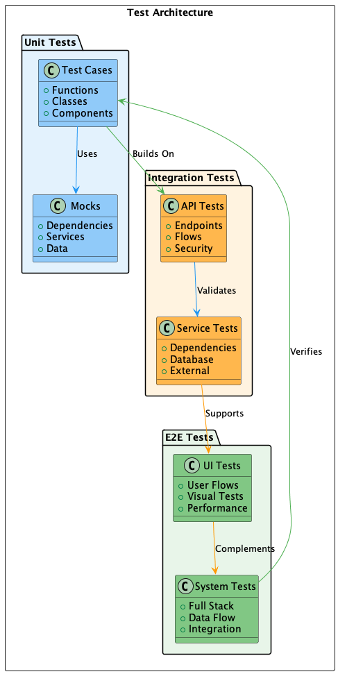

# 015 - 📝 🧪 Padrões de Teste

Data: 2024-03-21

## ⚡ Status

Aceito

## 🎯 Contexto

Com a arquitetura de microsserviços e DDD, precisamos:
- Garantir qualidade do código
- Facilitar refatoração segura
- Validar regras de negócio
- Testar integrações
- Automatizar testes
- Manter velocidade de desenvolvimento
- Garantir cobertura adequada

## 🔨 Decisão

Adotar uma estratégia abrangente de testes em múltiplas camadas:

Princípios:
- Test-Driven Development (TDD)
- Testes como documentação
- Pirâmide de testes
- Isolamento de dependências
- Testes determinísticos
- Velocidade de execução
- Manutenibilidade

Padrões específicos:
- Testes Unitários:
  - Jest/JUnit para testes unitários
  - Mock de dependências externas
  - Cobertura mínima de 80%
  - Foco em regras de negócio

- Testes de Integração:
  - TestContainers para dependências
  - Testes de APIs com REST-assured
  - Testes de persistência
  - Integração com mensageria

- Testes de Contrato:
  - Pact para contratos de API
  - Spring Cloud Contract
  - Validação de schemas

- Testes E2E:
  - Cypress para frontend
  - Cucumber para BDD
  - Testes críticos de negócio
  - Smoke tests em produção

## 📊 Diagrama

## 📊 Consequências

### Positivas

- Maior confiabilidade do código
- Documentação viva
- Refatoração segura
- Detecção precoce de bugs
- Melhor design de código
- Facilidade de manutenção
- Redução de bugs em produção

### Negativas

- Tempo adicional de desenvolvimento
- Manutenção de testes
- Infraestrutura de CI/CD robusta
- Necessidade de expertise em testes
- Overhead em projetos pequenos

### Riscos

- Testes frágeis
  - Mitigação: Padrões e revisão
- Testes lentos
  - Mitigação: Otimização e paralelismo
- Falsos positivos
  - Mitigação: Testes determinísticos

## 🔄 Alternativas Consideradas

### Apenas Testes Manuais
- Prós: Menor overhead inicial
- Contras: Não escalável, propenso a erros

### Foco em Testes E2E
- Prós: Mais próximo do usuário
- Contras: Lentos, frágeis, caros

### Testes Somente Unitários
- Prós: Rápidos, fáceis de manter
- Contras: Não garantem integração

## 📚 Referências

- [Test Pyramid](https://martinfowler.com/articles/practical-test-pyramid.html)
- [TDD By Example](https://www.amazon.com/Test-Driven-Development-Kent-Beck/dp/0321146530)
- [Contract Testing](https://pact.io/)
- [TestContainers](https://www.testcontainers.org/)

## 📝 Notas

- Criar templates de testes
- Estabelecer guias por tipo de teste
- Definir métricas de qualidade
- Configurar pipeline de testes
- Implementar relatórios de cobertura
- Treinar equipe em TDD 