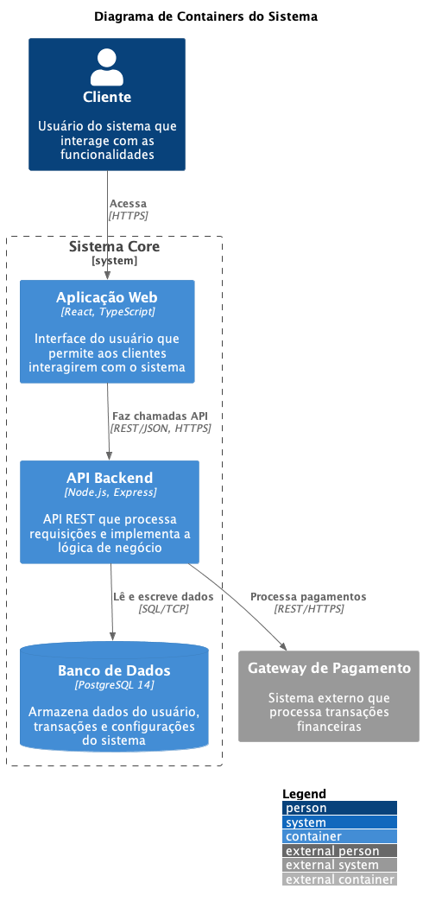
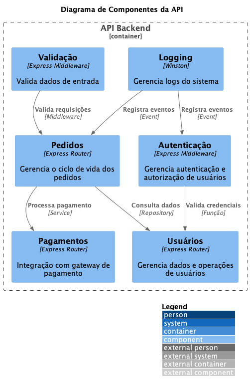
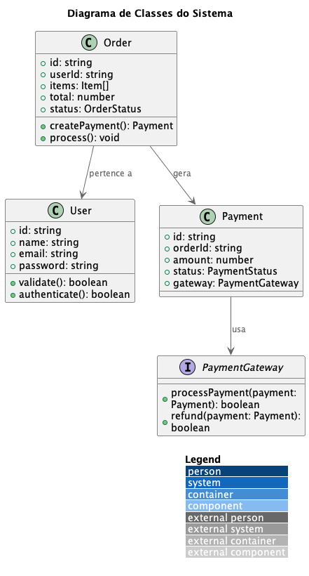
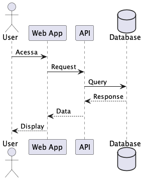
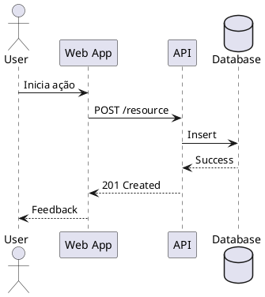

# 039 - 📝 📊 Diagramas C4 Model

Data: 2024-03-21

## ⚡ Status

Aceito

## 🎯 Contexto

Nossa documentação de arquitetura precisa:
- Ser clara e compreensível para diferentes stakeholders
- Representar diferentes níveis de abstração
- Seguir um padrão consistente
- Facilitar a comunicação entre equipes
- Documentar decisões arquiteturais
- Manter-se atualizada e relevante
- Servir como referência para implementação

## 🔨 Decisão

Adotar o C4 Model como padrão para diagramação de arquitetura.

Justificativas:
- Modelo hierárquico com diferentes níveis de detalhe
- Notação simples e intuitiva
- Suporte a diferentes perspectivas
- Integração com PlantUML
- Fácil versionamento (texto plano)
- Padrão reconhecido na indústria
- Documentação abundante

## 📊 Diagramas

### Contexto


```plantuml
@startuml
!include C4_Context.puml

Person(customer, "Cliente", "Usuário do sistema")
System(system, "Sistema", "Core business system")
System_Ext(payment, "Gateway Pagamento", "Processador de pagamentos")

Rel(customer, system, "Usa")
Rel(system, payment, "Processa pagamentos")
@enduml
```

### Containers


```plantuml
@startuml
!include C4_Container.puml

Container(web, "Web App", "React", "Interface do usuário")
Container(api, "API", "Node.js", "Backend API")
ContainerDb(db, "Database", "PostgreSQL", "Dados do sistema")

Rel(web, api, "API calls", "REST/JSON")
Rel(api, db, "Reads/Writes", "SQL")
@enduml
```

### Componentes


```plantuml
@startuml
!include C4_Component.puml

Component(auth, "Auth", "Autenticação")
Component(orders, "Orders", "Gestão de pedidos")
Component(users, "Users", "Gestão de usuários")

Rel(auth, users, "Valida")
Rel(orders, users, "Consulta")
@enduml
```

### Código


```plantuml
@startuml
!include C4_Code.puml

Class(Order)
Class(User)
Interface(PaymentGateway)

Order --> User
Order --> PaymentGateway
@enduml
```

### Sequência




## 📊 Consequências

### Positivas

- Documentação clara e padronizada
- Diferentes níveis de abstração
- Facilidade de manutenção
- Versionamento simplificado
- Geração automatizada
- Integração com ferramentas existentes
- Comunicação efetiva entre equipes

### Negativas

- Curva de aprendizado inicial
- Necessidade de ferramentas específicas
- Manutenção manual dos diagramas
- Possível desatualização se não mantido

### Riscos

- Diagramas desatualizados
  - Mitigação: Integrar com CI/CD, revisões periódicas
- Complexidade excessiva
  - Mitigação: Seguir princípio de abstração adequada
- Resistência à adoção
  - Mitigação: Treinamento e documentação clara

## 🔄 Alternativas Consideradas

### UML Tradicional
- Prós: Amplamente conhecido, ferramentas maduras
- Contras: Complexo, foco em implementação

### Mermaid
- Prós: Simples, integração com Markdown
- Contras: Menos recursos, limitações visuais

### Draw.io
- Prós: Interface gráfica, fácil uso
- Contras: Difícil versionamento, sem padrão definido

## 📚 Referências

- [C4 Model](https://c4model.com/)
- [PlantUML](https://plantuml.com/)
- [C4-PlantUML](https://github.com/plantuml-stdlib/C4-PlantUML)
- [Structurizr](https://structurizr.com/)

## 📝 Notas

- Criar templates para cada tipo de diagrama
- Estabelecer processo de revisão
- Integrar com documentação existente
- Treinar equipes no padrão
- Definir ciclo de atualização 