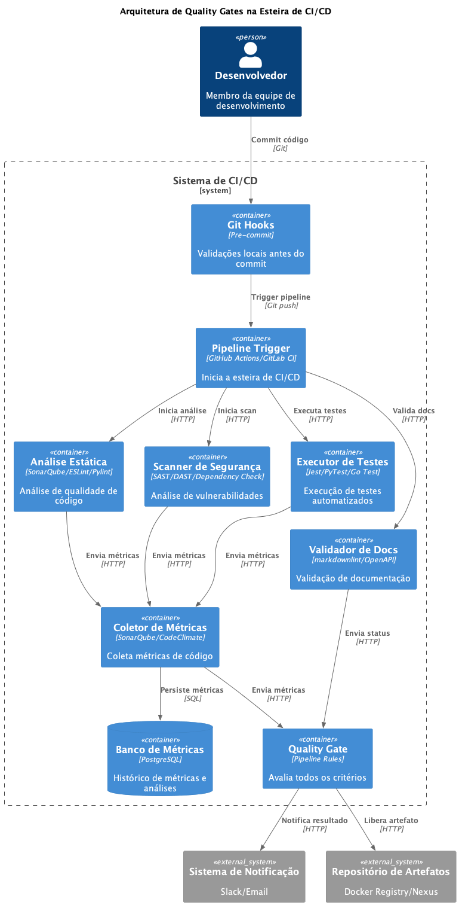

# 033 - 🛡️ Quality Gates na Esteira de CI/CD

Data: 2024-04-19

## ⚡ Status

Proposto

## 🎯 Contexto

A qualidade do código e a segurança são aspectos críticos no desenvolvimento de software. É necessário estabelecer gates automatizados na esteira de CI/CD para garantir:
- Consistência e qualidade do código
- Detecção precoce de vulnerabilidades
- Conformidade com padrões e boas práticas
- Redução de débito técnico
- Prevenção de regressões
- Documentação atualizada
- Cobertura de testes adequada

## 🔨 Decisão

Implementar Quality Gates em múltiplos níveis na esteira de CI/CD:

1. **Análise Estática**
   - Linting (ESLint, Pylint, golangci-lint)
   - Formatação (Prettier, Black, gofmt)
   - Complexidade ciclomática
   - Code smells
   - Duplicação de código
   - Type checking

2. **Segurança**
   - SAST (Static Application Security Testing)
   - Análise de dependências
   - Secrets scanning
   - Container scanning
   - License compliance
   - DAST (Dynamic Application Security Testing)

3. **Testes**
   - Cobertura mínima (80%)
   - Testes unitários
   - Testes de integração
   - Testes de contrato
   - Testes de performance
   - Smoke tests

4. **Documentação**
   - README atualizado
   - Documentação de API
   - ADRs
   - Changelog
   - Comentários de código

5. **Métricas de Código**
   - Maintainability Index
   - Technical Debt Ratio
   - SOLID Principles
   - Clean Code Metrics
   - Cognitive Complexity

6. **Controle de Versão**
   - Conventional Commits
   - Branch Protection
   - Code Review
   - PR Templates
   - Merge Checks

## 📊 Consequências

### Positivas

- Maior qualidade de código
- Detecção precoce de problemas
- Redução de custos de manutenção
- Maior segurança
- Padronização do desenvolvimento
- Documentação sempre atualizada
- Melhor experiência de desenvolvimento

### Negativas

- Pipeline mais lento
- Maior complexidade na configuração
- Possível resistência da equipe
- Necessidade de manutenção dos gates
- Falsos positivos

### Riscos

- Gates muito restritivos
  - Mitigação: Ajuste gradual dos thresholds
- Sobrecarga de validações
  - Mitigação: Paralelização e caching
- Falsos positivos frequentes
  - Mitigação: Refinamento contínuo das regras

## 🔄 Alternativas Consideradas

### Validação Manual
- Prós: Flexibilidade
- Contras: Erro humano, inconsistência

### Gates Mínimos
- Prós: Pipeline mais rápido
- Contras: Menor garantia de qualidade

### Gates por Ambiente
- Prós: Diferentes níveis de rigor
- Contras: Complexidade de manutenção

## 📚 Referências

- [SonarQube Quality Gates](https://docs.sonarqube.org/latest/user-guide/quality-gates/)
- [OWASP Code Review Guide](https://owasp.org/www-project-code-review-guide/)
- [Google Engineering Practices](https://google.github.io/eng-practices/)
- [Clean Code by Robert C. Martin](https://www.amazon.com/Clean-Code-Handbook-Software-Craftsmanship/dp/0132350882)

## 📝 Notas

- Implementar gates gradualmente
- Ajustar thresholds com feedback da equipe
- Manter documentação dos gates atualizada
- Revisar e atualizar regras periodicamente
- Automatizar remediação quando possível
- Prover feedback claro para desenvolvedores

## 🎨 Exemplos de Configuração

```yaml
# Pipeline Quality Gates
quality_gates:
  static_analysis:
    linting:
      eslint:
        max_warnings: 0
        rules: "recommended"
      pylint:
        min_score: 8.0
        disable: ["C0111"]
    complexity:
      cyclomatic: 15
      cognitive: 10
      maintainability: 70
    duplication:
      threshold: 3%
      
  security:
    sast:
      severity: ["CRITICAL", "HIGH"]
      fail_on: "CRITICAL"
    dependencies:
      max_vulnerabilities:
        critical: 0
        high: 0
      outdated: 5%
    secrets:
      patterns: ["API_KEY", "PASSWORD"]
      
  testing:
    coverage:
      lines: 80%
      branches: 75%
      functions: 85%
    performance:
      response_time: 200ms
      error_rate: 1%
      
  documentation:
    required_files:
      - README.md
      - CHANGELOG.md
      - API.md
    openapi:
      version: "3.0"
      validate: true
      
  metrics:
    debt_ratio: 5%
    code_smells:
      critical: 0
      major: 5
    duplications: 3%
    
  version_control:
    commits:
      pattern: "^(feat|fix|docs|style|refactor|test|chore)"
    reviews:
      required: 2
      codeowners: true
```

## 🔍 Métricas de Avaliação

1. **Qualidade**
   - Taxa de aprovação em primeira análise
   - Tempo médio de correção
   - Redução de débito técnico
   - Cobertura de código

2. **Produtividade**
   - Tempo de ciclo do pipeline
   - Taxa de falsos positivos
   - Frequência de builds quebrados
   - Tempo de resolução

3. **Segurança**
   - Vulnerabilidades detectadas
   - Tempo de remediação
   - Cobertura de análise
   - Incidentes prevenidos 

## 📊 Diagrama

 