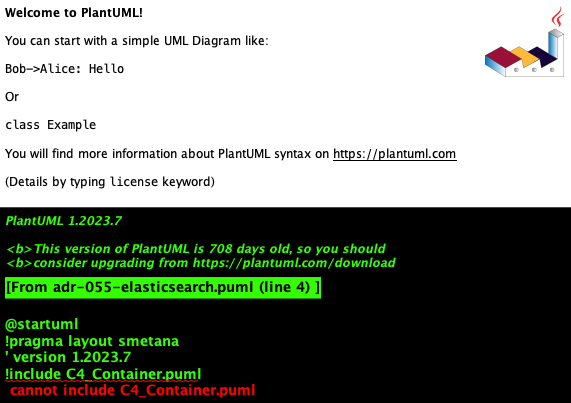

# ADR-055 - Adoção do ElasticSearch

## Status

Proposto

## Contexto

Nossa aplicação necessita de capacidades avançadas de busca, incluindo busca full-text, análise de dados em tempo real e visualização de dados. Precisamos de uma solução que seja escalável, performática e que ofereça recursos avançados de busca e análise.

## Decisão

Decidimos adotar o ElasticSearch como nossa solução de busca e análise de dados, junto com a stack ELK (Elasticsearch, Logstash, Kibana) completa para maximizar os benefícios da plataforma.

### Componentes Principais

1. **ElasticSearch**
   - Motor de busca distribuído
   - Armazenamento e indexação de dados
   - API REST para integração
   - Suporte a clustering e alta disponibilidade

2. **Kibana**
   - Interface de visualização de dados
   - Dashboards personalizáveis
   - Exploração de dados em tempo real
   - Monitoramento do cluster

3. **Logstash**
   - Pipeline de processamento de dados
   - Transformação e enriquecimento de dados
   - Múltiplas fontes de entrada
   - Filtros configuráveis

4. **Beats**
   - Coletores de dados leves
   - Envio de logs, métricas e dados
   - Baixo overhead
   - Fácil implantação

## Consequências

### Positivas

1. **Busca Avançada**
   - Full-text search
   - Busca facetada
   - Análise de relevância
   - Sugestões e autocomplete

2. **Escalabilidade**
   - Arquitetura distribuída
   - Sharding automático
   - Replicação de dados
   - Balanceamento de carga

3. **Análise em Tempo Real**
   - Agregações em tempo real
   - Visualizações interativas
   - Alertas baseados em dados
   - Monitoramento contínuo

4. **Flexibilidade**
   - Schema-less
   - Múltiplos tipos de dados
   - APIs RESTful
   - Integrações extensivas

### Negativas

1. **Complexidade**
   - Curva de aprendizado
   - Configuração inicial complexa
   - Necessidade de expertise

2. **Recursos**
   - Consumo de memória significativo
   - Necessidade de storage otimizado
   - Custos de infraestrutura

3. **Manutenção**
   - Updates frequentes
   - Monitoramento constante
   - Backup e recuperação

## Alternativas Consideradas

1. **Solr**
   - Mais maduro
   - Menos recursos modernos
   - Menor comunidade atual

2. **MongoDB Full-Text Search**
   - Integrado ao MongoDB
   - Menos recursos especializados
   - Limitações de escalabilidade

3. **PostgreSQL Full-Text Search**
   - Solução mais simples
   - Integrado ao banco principal
   - Limitações de performance em escala

## Referências

- [Documentação Oficial do ElasticSearch](https://www.elastic.co/guide/index.html)
- [Guia de Arquitetura ELK Stack](https://www.elastic.co/pt/elastic-stack)
- [Best Practices](https://www.elastic.co/guide/en/elasticsearch/reference/current/general-recommendations.html) 