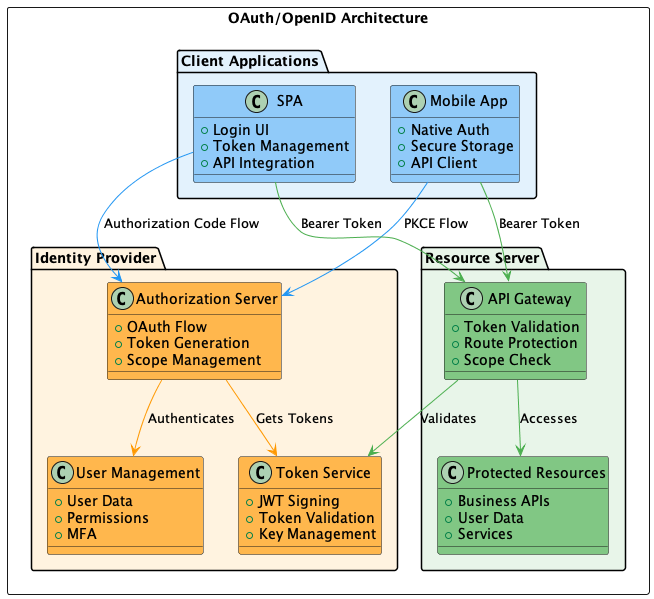

# 005 - 📝 🔐 Autenticação com OAuth e OpenID Connect

Data: 2024-03-21

## ⚡ Status

Aceito

## 🎯 Contexto

Nossa aplicação necessita de um sistema de autenticação e autorização robusto e seguro:
- Múltiplos clientes e tipos de aplicação
- Necessidade de integração com sistemas externos
- Requisitos de SSO (Single Sign-On)
- Complexidade no gerenciamento de sessões
- Necessidade de delegação de acesso
- Conformidade com padrões de segurança

## 🔨 Decisão

Implementar OAuth 2.0 com OpenID Connect como solução de autenticação e autorização.

Justificativas:
- Padrão da indústria amplamente adotado
- Suporte a múltiplos fluxos de autenticação
- Separação clara entre autenticação e autorização
- Integração facilitada com serviços externos
- Suporte nativo a SSO
- Tokens JWT com claims padronizados
- Segurança robusta e testada
- Ecossistema maduro de bibliotecas

## 📊 Diagrama

## 📊 Consequências

### Positivas

- Autenticação padronizada e segura
- Facilidade de integração com terceiros
- Suporte a múltiplos clientes
- Gerenciamento centralizado de identidade
- Delegação segura de acesso
- Conformidade com padrões de segurança
- Melhor experiência do usuário com SSO

### Negativas

- Complexidade na implementação inicial
- Overhead em requisições
- Necessidade de gerenciamento de tokens
- Configuração adicional de segurança
- Maior complexidade no desenvolvimento local

### Riscos

- Exposição de tokens sensíveis
  - Mitigação: Implementação correta de storage seguro
- Configuração incorreta de CORS
  - Mitigação: Políticas estritas e bem documentadas
- Complexidade nos fluxos de refresh
  - Mitigação: Implementação de refresh automático

## 🔄 Alternativas Consideradas

### JWT Simples
- Prós: Mais simples de implementar
- Contras: Menos recursos, sem padrões definidos

### SAML
- Prós: Mais maduro, suporte enterprise
- Contras: Mais complexo, focado em SOAP

### Autenticação Própria
- Prós: Controle total sobre implementação
- Contras: Risco de falhas de segurança, manutenção complexa

## 📚 Referências

- [OAuth 2.0 Specification](https://oauth.net/2/)
- [OpenID Connect Core](https://openid.net/specs/openid-connect-core-1_0.html)
- [OAuth 2.0 Security Best Practices](https://oauth.net/2/security-best-practices/)
- [JWT Best Practices](https://datatracker.ietf.org/doc/html/draft-ietf-oauth-jwt-bcp)

## 📝 Notas

- Necessário definir estratégia de refresh tokens
- Importante implementar revogação de tokens
- Documentar fluxos de autenticação por tipo de cliente
- Configurar monitoramento de tentativas de acesso suspeitas 