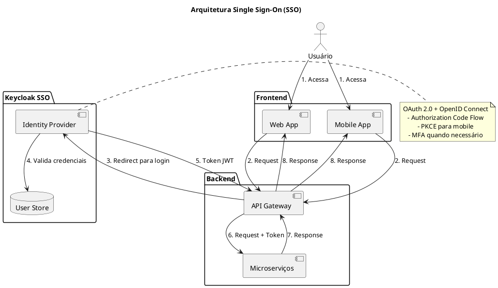

# 014 - 📝 🔐 Single Sign-On

Data: 2024-03-21

## ⚡ Status

Aceito

## 🎯 Contexto

Com múltiplas aplicações e serviços, precisamos:
- Unificar a experiência de autenticação
- Garantir segurança consistente
- Simplificar gestão de identidades
- Facilitar integração com sistemas externos
- Suportar diferentes tipos de clientes
- Implementar MFA
- Atender requisitos de compliance

## 🔨 Decisão

Implementar SSO usando OAuth 2.0 e OpenID Connect com Keycloak como provedor de identidade:

Princípios:
- Autenticação centralizada
- Autorização baseada em claims
- Federação de identidade
- Zero trust architecture
- Security by design
- Privacy by design
- Auditoria completa

Padrões específicos:
- OAuth 2.0 para autorização
- OpenID Connect para autenticação
- Keycloak como IdP principal
- JWT como formato de token
- PKCE para clients públicos
- MFA obrigatório para acessos críticos
- Refresh tokens com rotação

## 📊 Diagrama

## 📊 Consequências

### Positivas

- Experiência unificada de login
- Gestão centralizada de identidades
- Segurança padronizada
- Suporte a múltiplos protocolos
- Facilidade de integração
- Auditoria centralizada
- Conformidade com padrões
- Redução de custos operacionais

### Negativas

- Ponto único de falha
- Complexidade de configuração
- Overhead de rede adicional
- Necessidade de alta disponibilidade
- Custo de infraestrutura

### Riscos

- Indisponibilidade do SSO
  - Mitigação: Alta disponibilidade e DR
- Comprometimento de credenciais
  - Mitigação: MFA e monitoramento
- Complexidade de migração
  - Mitigação: Migração gradual e suporte legado

## 🔄 Alternativas Consideradas

### Auth0
- Prós: Managed service, fácil setup
- Contras: Custo alto, vendor lock-in

### Okta
- Prós: Enterprise-ready, suporte forte
- Contras: Complexidade, custo

### Implementação própria
- Prós: Controle total, customização
- Contras: Custo de desenvolvimento, manutenção

## 📚 Referências

- [OAuth 2.0](https://oauth.net/2/)
- [OpenID Connect](https://openid.net/connect/)
- [Keycloak Documentation](https://www.keycloak.org/documentation)
- [Zero Trust Architecture](https://www.nist.gov/publications/zero-trust-architecture)

## 📝 Notas

- Criar guia de implementação
- Estabelecer padrões de segurança
- Definir processo de onboarding
- Documentar fluxos de autenticação
- Implementar monitoramento
- Treinar equipe em OAuth/OIDC 