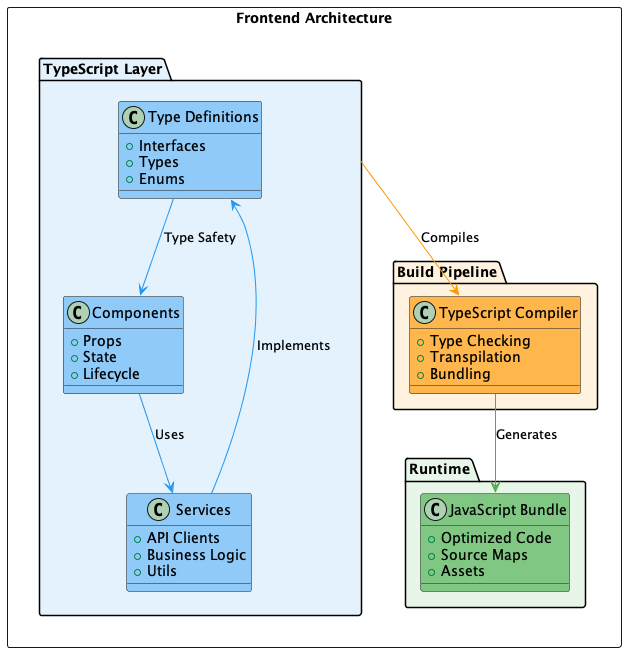

# 001 - 📝 🌐 TypeScript no Frontend

Data: 2024-03-21

## ⚡ Status

Aceito

## 🎯 Contexto

Nossa aplicação frontend está crescendo em complexidade, e temos enfrentado diversos desafios:
- Dificuldade em manter a qualidade do código
- Erros de runtime que poderiam ser pegos em tempo de compilação
- Dificuldade na refatoração e manutenção do código
- Documentação inconsistente dos componentes e interfaces
- Produtividade reduzida devido à falta de autocompleção e intellisense adequados

## 🔨 Decisão

Decidimos adotar o TypeScript como linguagem principal para o desenvolvimento frontend, migrando gradualmente o código JavaScript existente.

Justificativas:
- Tipagem estática que permite catch de erros em tempo de compilação
- Melhor suporte de IDE com autocompleção e refatoração
- Documentação implícita através dos tipos
- Grande adoção na comunidade e ecossistema maduro
- Compatibilidade com JavaScript existente, permitindo migração gradual
- Melhoria na manutenibilidade e legibilidade do código

## 📊 Diagrama

## 📊 Consequências

### Positivas

- Maior confiabilidade do código com verificação de tipos
- Melhor experiência de desenvolvimento com suporte de IDE
- Documentação mais clara através dos tipos
- Facilidade de refatoração
- Menor quantidade de testes unitários necessários para validar tipos
- Melhor onboarding de novos desenvolvedores

### Negativas

- Curva de aprendizado inicial para desenvolvedores não familiarizados com TypeScript
- Tempo adicional na configuração inicial do projeto
- Overhead no processo de build
- Necessidade de definir e manter definições de tipos

### Riscos

- Resistência da equipe à mudança
  - Mitigação: Treinamentos e pair programming
- Complexidade adicional nas configurações de build
  - Mitigação: Documentação clara do setup e templates prontos
- Overhead de desenvolvimento inicial
  - Mitigação: Migração gradual e foco em novos componentes primeiro

## 🔄 Alternativas Consideradas

### Flow
- Prós: Mais simples que TypeScript
- Contras: Menor adoção, ecossistema menor, menos recursos

### PropTypes
- Prós: Já integrado com React
- Contras: Apenas validação em runtime, sem benefícios de IDE

### JavaScript + JSDoc
- Prós: Não requer compilação
- Contras: Verboso, menor suporte de ferramentas

## 📚 Referências

- [TypeScript Documentation](https://www.typescriptlang.org/docs/)
- [TypeScript vs Flow](https://github.com/niieani/typescript-vs-flowtype)
- [React TypeScript Cheatsheet](https://react-typescript-cheatsheet.netlify.app/)

## 📝 Notas

- A migração será feita gradualmente, começando por novos componentes
- Será criado um guia de estilo TypeScript para o projeto
- Revisões de código terão foco especial na qualidade dos tipos definidos 